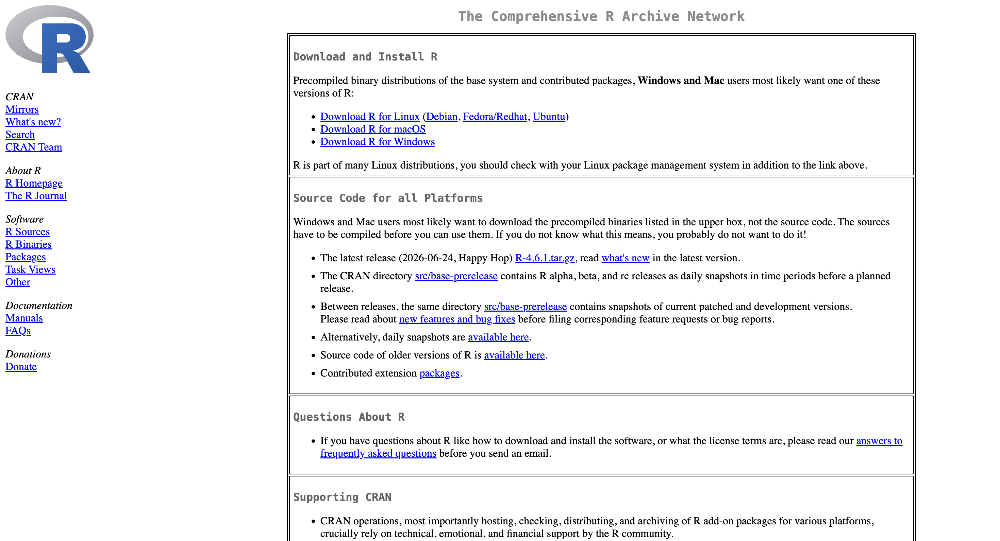
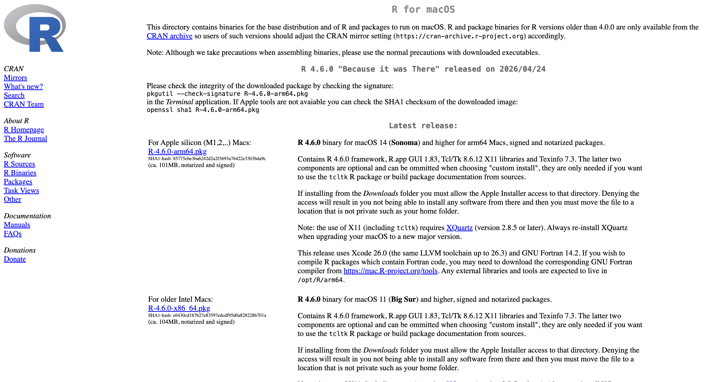
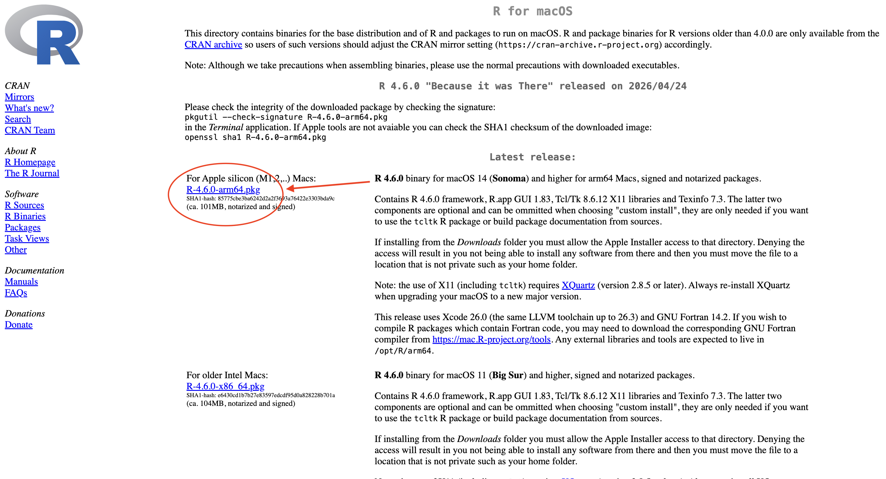
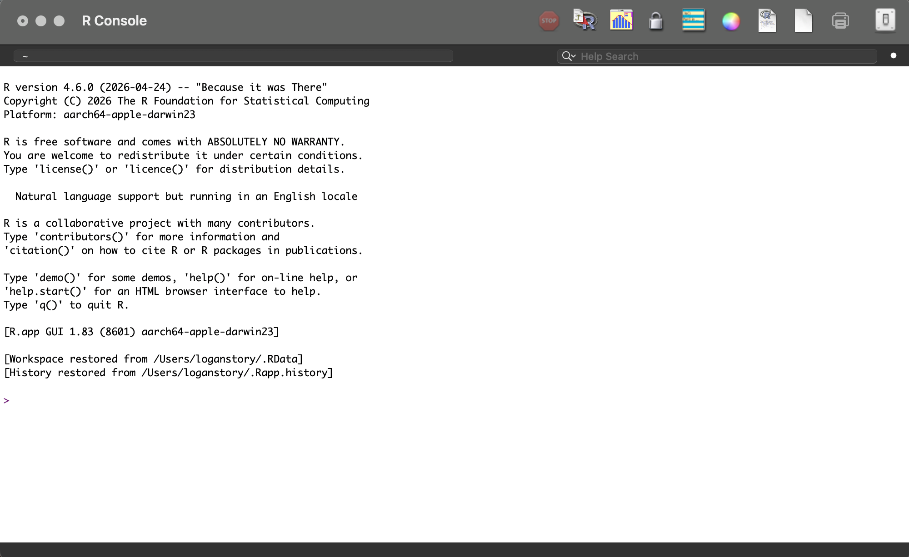
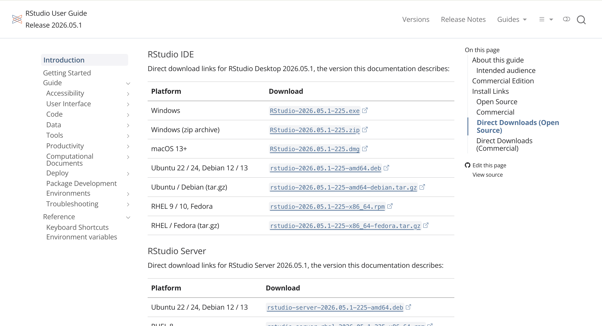
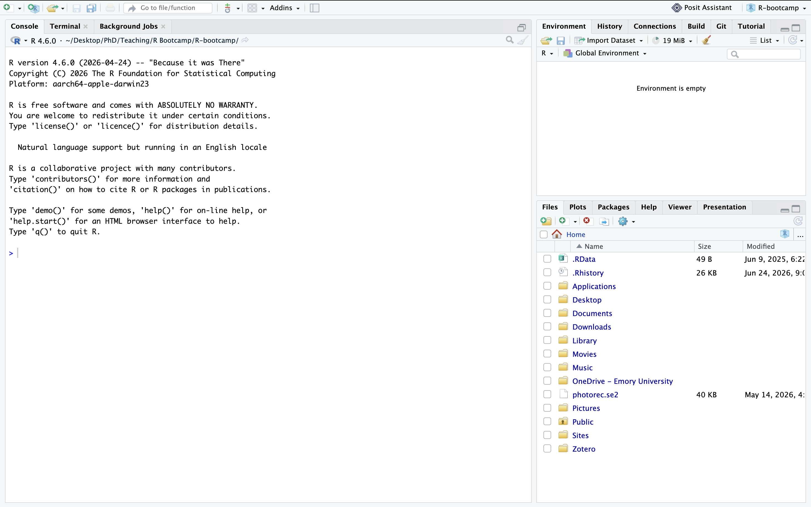

Before we even begin, it's incredibly important we actually have the software we need downloaded on our computer. So, to get started, you should probably go ahead and download R and RStudio onto your computer. (Again, did I mention that it's free?)

## Download R

**Visit [this link here](https://cloud.r-project.org/) to get started with downloading R.**

Once you open the webpage it should look something like the below image.

{width="755"}

There's a lot of hyperlinks here, so start by directing your attention to the first three links towards the top. Click on the associated "Download R for..." your current operating system. I'll be doing this tutorial, and most other coding demonstrations in this bootcamp, using a macOS operating system. Windows and Mac don't largely differ when using RStudio or R, but if you find yourself confused, don't hesitate to ask me any questions you might have.

Once you hit download you will be redirected to another webpage, with even more links.

Click on the hyperlink that is associated with your current operating system. For most users, it should be the most up-to-date version of your internal operating system. For me, that's currently macOS Sequoia 15.1.1, which means I would choose the blue hyperlink that says 'R-4.6.0-arm64.pkg'.

Click that link, allow the R package to download onto your computer, then follow your computers prompts to download it onto your device.

Once downloaded, if you open R, you'll get a console environment that looks like this.

Great! You now have R installed. However, you'll soon discover this is not the most user-friendly or flexible application to be doing the analyses or visualizations we'd like to do. Instead, we're going to be using **RStudio as our main interface for this course.**

## Download RStudio

**Visit [this link here](https://docs.posit.co/ide/user/#rstudio-ide-oss-downloads) to download RStudio.**

Again, you'll be redirected to a website with a lot of hyperlinks. If you are at the top of the webpage where is says "**RStudio IDE User Guide**", scroll down until you find the set of links pictured below:

Click the link that is associated with your operating system and allow the installer disk to download. Then, follow the instillation instructions when prompted by your computer.

Now, to make sure RStudio is correctly installed, go ahead and open the application for the first time. Your screen should look something like the below image (although your "File" window in the bottom right may appear different from mine).

::: callout-caution
**Apple and macOS users:** You may receive a warning from Apple security that confirms if you'd like to open the application for the first time. This is normal, and don't be afraid to hit the "Open" button. If you followed the correct directions from the websites I've hyper linked in this guide, there will be no danger to your computer by opening the application. I pinky promise.
:::

**Congrats! You've now successfully downloaded and installed both R and RStudio onto your computer.** This is a huge milestone in your learning as a scientist. Feel free to poke around and explore this interface if you'd like. This boot camp will cover a lot of the necessary elements we'll be using in the course, but it's always good to familiarize yourself with a new operating software if you can.

**Happy Coding!**

{width="295"}
