# R and RMarkdown Basics


Welcome to your "first" R bootcamp tutorial! Well, technically this is tutorial 0, but this lesson will form the foundational knowledge you will need to start learning the basics of coding in R! Let's get started...

## Learning Objectives

1.  Be able to describe and navigate the RStudio computing environment.

2.  Learn how to set your working directory and understand pathing in a computing environment.

3.  Learn how to create new script and .rmd files.

4.  Be able to set evaluations and customizations in .rmd code chunks with knitr::.

5.  Understand good code etiquette and commenting guidelines, especially with research reproducibility in mind.

## Tour De RStudio

Start by opening the RStudio application.

If you're opening RStudio for the first time this might be quite overwhelming. Fear not, this will become more familiar over the course of the next 6 weeks.

For now, let's break this down as if you were currently working on a project:

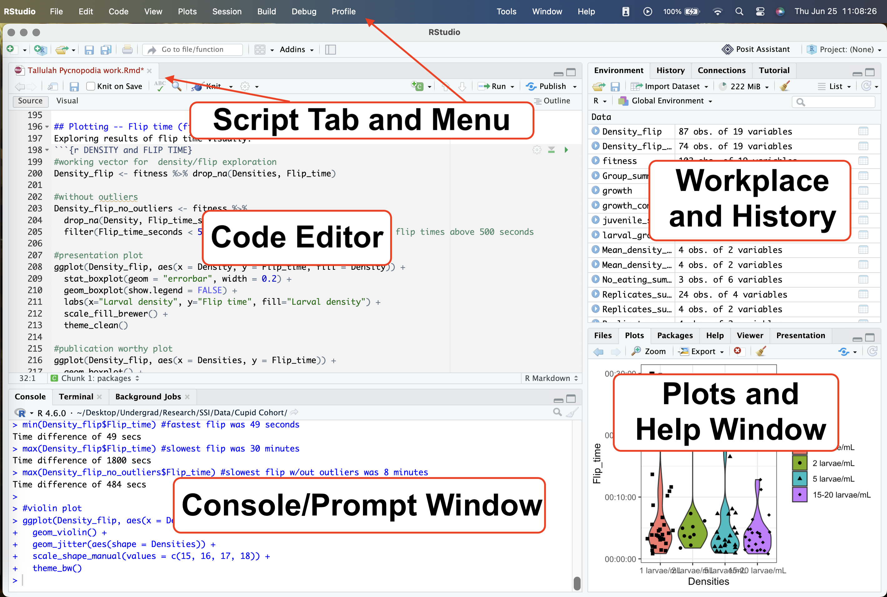

- At the top of your interface you have your **menu** and **script tab**. This is where the data sets and files you're actively working on live. You can easily navigate between files like you would between tabs on a search engine.

- Below these tabs is your **code editor.** This is where the permanent, written down portions of your code live.

- Below the code editor is the **Console**, **Terminal**, and **Background Jobs** windows. The Console is where outputs from your commands are printed (depending on your global chunk options). You can also type commands directly into the Console.

::: callout-warning
**Typing code directly into the Console [will not]{.underline} permanently save any of your work after you close out of your current RStudio session.**

I highly recommend conducting all your coding for this course in the code editor rather than in the console.
:::

- The far right top window is your **Environment** - where all your data sets and vectors live. To view any of these in full screen you can simply press on the blue and white play button to the left of the vector name and it will open up in the script tab.

- The bottom right of the screen is where **Help** prompts and **Plots** can be viewed. You can also view files in your working directory from here by navigating to the **Files** window.

Now your RStudio won't look exactly like that above screenshot when you open it for the first time. Instead, it will look more like the screenshot below.

Firstly, direct your attention to the top tab that says Console, Terminal, and Background Jobs.

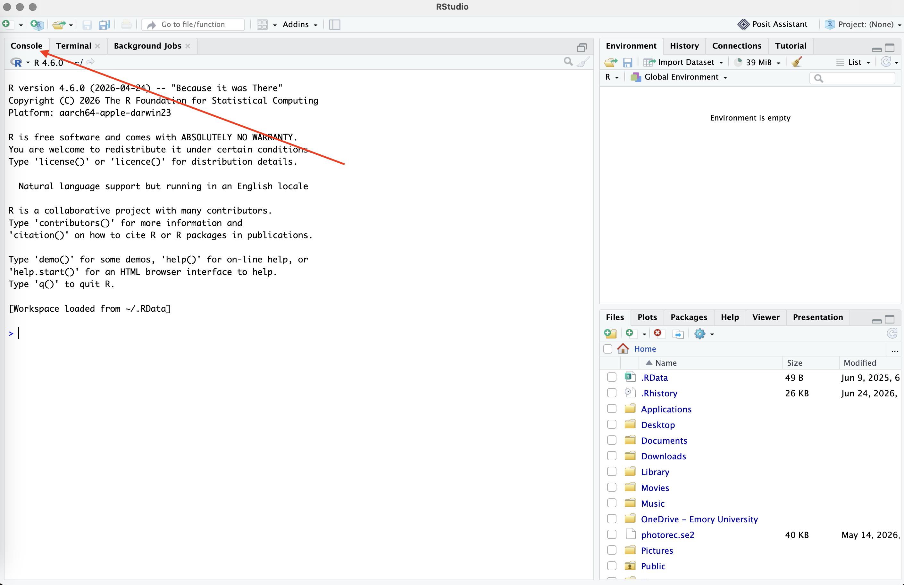{width="450"}

Again, the **Console** is where [you code directly with `R` and where outputs to commands will **print**]{.underline}.

Find the point where your cursor is blinking towards the bottom. The `>` indicates the **Prompt** space. This is where you can type your commands directly into the Console.

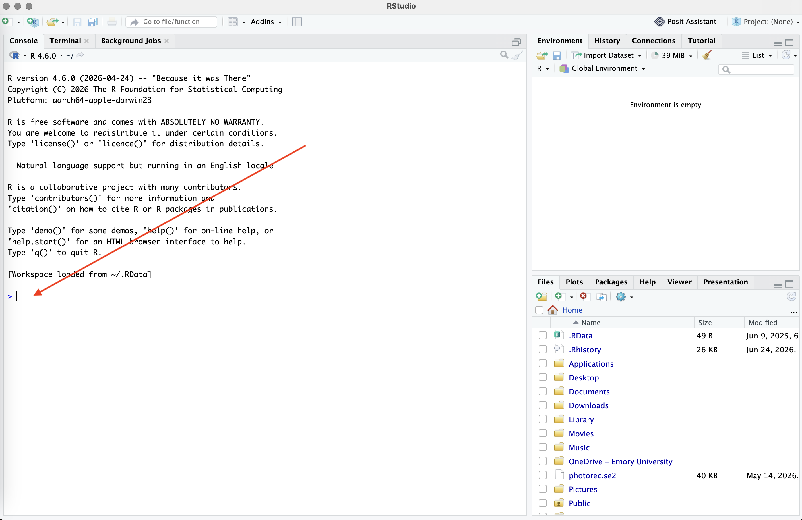{width="450"}

## Setting your working directory

Now, we're going to type out our first ever command into the **Console**! Yay! Go ahead and either manually type or copy/paste the command below then press 'return' or 'Enter' on your keyboard.

```{r, eval=FALSE}
getwd()
```

Congrats!! You've now typed your first command in `R`. This should result in a response being **printed** below your command that looks (something) like this:

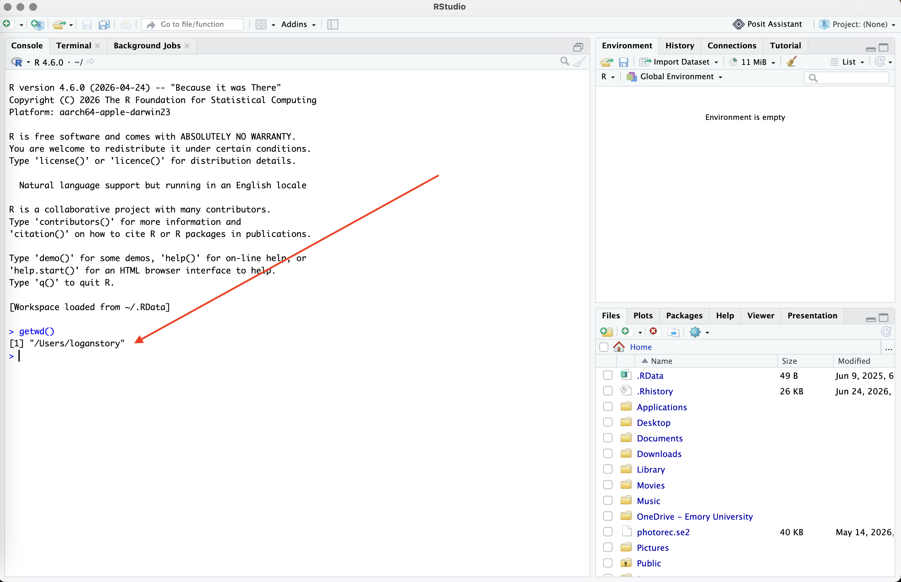{width="672"}

Above, you asked `R` to "get my working directory" with the command `getwd()` by using the starting prompt `>` in the Console; A response was printed after you hit Enter.

This is lot's of new vocabulary, so lets zoom it in and break it down.

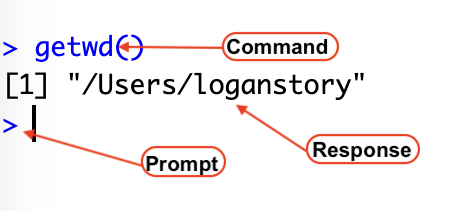

Here you've **commanded** `R` to `getwd()` and it **prints** your [response]{.underline}, above a new **prompt** line.

This is how `R` works (for the most part). You type a command in the Console (or in a `R` chunk) and it will either:

1.  Print a response for you in the Console.

2.  Open file into the script tab.

3.  Open a plot on the bottom right.

4.  Open the help window.

As you can see, when I run the command `getwd()`, it tells me that my current **working directory** is a general space on my computer called `/Users/loganstory`. What this really means is that when I try to read new files into `R`, or "write" files out of `R`, it will assume that I want to put them in this general folder.

::: callout-tip
As a good practice, *getting* and *setting* your **working directory** is one of the first things you want to do when starting a new project, document, or script file. Doing this tells R where to [locate]{.underline} and [save]{.underline} files as your work on your code.
:::

There are **two** methods to set your working directory...

### Option 1: Manually set your working directory

In order to change your working directory manually, we will use the `setwd()` command.

For example, if I wanted to change my working directory to an existing folder called *`R-bootcamp`* located on my *`Desktop`* under my *`PhD`* and *`Teaching`* folders, I’d run the following code:

```{r}
setwd("/Users/loganstory/Desktop/PhD/Teaching/R Bootcamp/R-bootcamp")
```

This is the directory path R will now use when searching and saving files as I work: Users \> loganstory \> Desktop \> PhD \> Teaching \> R Bootcamp \> R-bootcamp. The "\>" indicates the directionality that `R` is searching in my computer for the workspace.

### Option 2: Point-and-Click Approach in RStudio

The second option to set your working directory is the point-and-click approach (I personally prefer setting my directory manually, but others might like this better).

To do this:

1.  Go to **Session** in the menu.

2.  Select **Set Working Directory**.

3.  Choose **Choose Directory...** and navigate to the desired folder on your computer.

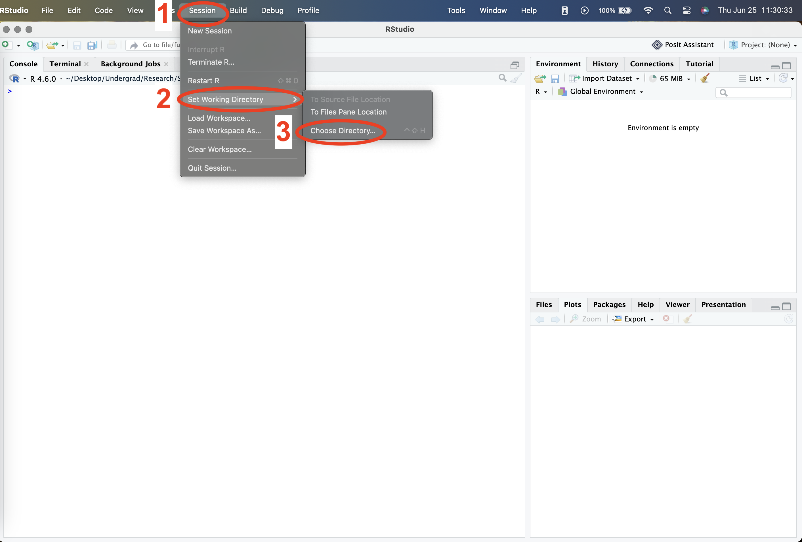{width="450"}

### (Optional) Option 3: Working with RStudio Rprojects

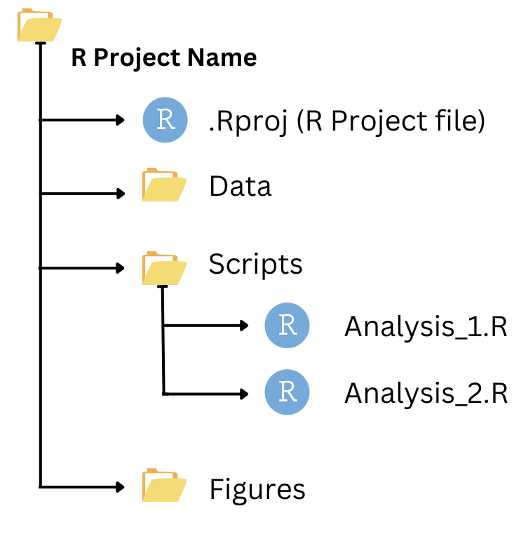{width="178"}

RStudio Projects provide a convenient way to manage and organize your data analysis work. **Instead of setting your working directory every time, you can work within a Rproject and won't have to worry about setting a working directory every time you make a new file.**

A project creates an isolated workspace, ensuring that all files, data, and settings are kept together. This helps maintain a clear and organized workflow, especially for complex or long-term projects. We won't be using projects in this course, but this is yet another option at your disposal (if you so choose).

To create a new project in RStudio, you can take two different point-and-click approaches:

**Point-and-Click in the Menu:**

1.  Click on **File** in the menu.

2.  Select **New Project...**.

3.  Choose **New Directory** for a new project or **Existing Directory** to use an existing folder.

4.  Follow the prompts to set up your project.

**Point-and-click in RStudio:**

1.  Go to the top right corner and select the **Project: (None)** icon (should look like a little R in a 3-d cube).

2.  Select **New Project**.

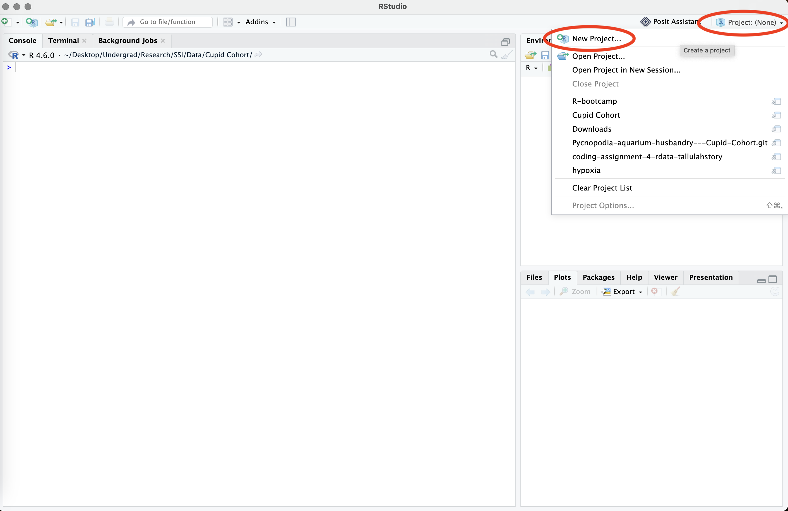{width="450"}

3.  Select **New Directory** -\> **New Project**. 
4.  Name your project and select a directory (i.e., folder where you are working).
5.  Click **Create Project**.

## Understanding Absolute and Relative Paths

For the sake of this course (and these tutorials), I'd like you to make a folder to set as your working directory before we proceed any further. You can use the following template if you'd like to keep things simple:

1.  Create a primary folder on your desktop called **EVE 113**.
2.  Create a sub-folder inside **EVE 113** called **Coding Tutorials** – (this will let you keep coding tutorial work and class coding work separate from one another).
3.  Create another sub-folder called **Tutorial 0**.

The **path** you've just created will be something along the lines of:

| `/Users/yourusername/Desktop/EVE 113/Coding Tutorials`

A **file path** tells you (and your computer) the exact place you can locate a file. Paths can either be [absolute]{.underline} or [relative]{.underline}. You use different paths, in different scenarios, to set your working directory.

An **absolute** path would be something like...

```{r, eval=FALSE}
setwd("/Users/yourusername/Desktop/EVE 113/Coding Tutorials/Tutorial 0") # on macOS
```

or

```{r, eval=FALSE}
setwd("C:\Users\yourusername\Desktop\EVE 113\Coding Tutorials\Tutorial 0") # on Windows
```

- Here the working directory is explicitly specified (`/Users/yourusername/Desktop/EVE 113/Coding Tutorials`).

- It includes the set destination for a file (`/Tutorial 0`, or essentially where you want to go with the path).

A **relative** path would be something like...

```{r, eval=FALSE}
setwd("./Tutorial 0")
```

- Here, the working directory is implicitly specified.

- A `.` before the forward or backslash indicates you are moving *down* the path, whereas `..` indicates movement *up* the path.

This idea is simply illustrated here:

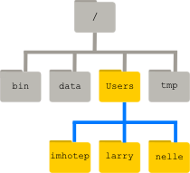

> **EXAMPLE**
>
> larry or nelle can set their working directory as `/Users/larry` or `/Users/nelle`.
>
> If either of them wanted to access a file called 'image.png' inside their working directory they would use the path `./image.png`.
>
> If either of them wanted to access a filed called 'image.png' *outside* of their working directory under `data`, they would use an absolute path of `/data/Documents/image.png`.

::: {.callout-tip appearance="simple" icon="false"}
**Do It Yourself T0.1**

1a. Using the Console, set your working directory to the **Tutorial 0** folder.

1b. Use a command to print your working directory.

1c. Change your working directory back to your **root** directory.
:::

Understanding the path concept will help you when saving, accessing, and moving around your internal operating system. If you encounter problems setting your working directory, try restarting the RStudio application before seeking further assistance.

## Creating a new Rmarkdown File

A .rmd (or Rmarkdown) file is a type of `R` script file that allows you to provide detailed descriptions of your code, analyses, and even interpretation.

Rmarkdown files also are also great for creating class assignments, writing manuscript code, or even cross-working between two different code languages (like `R` and `python`, for example). It's also has integrated tools to help with improving reproducibility, including both a visual and source code editor. These tutorials were written in a similar interface known as a quarto website, which functions relatively similarly to a Rmarkdown file.

To make a new .rmd file, go through the following steps:

1.  Set your working directory.

    ```{r, eval = FALSE}
    setwd("/Users/yourusenamehere/Desktop/EVE 113/Coding Tutorials/Tutorial 0")
    ```

2.  Check that you've successfully changed your working directory.

    ```{r, eval = FALSE}
    getwd()
    ```

3.  Proceed to the top left corner and click the **New File** icon.

4.  Scroll down and select **R Markdown**...

    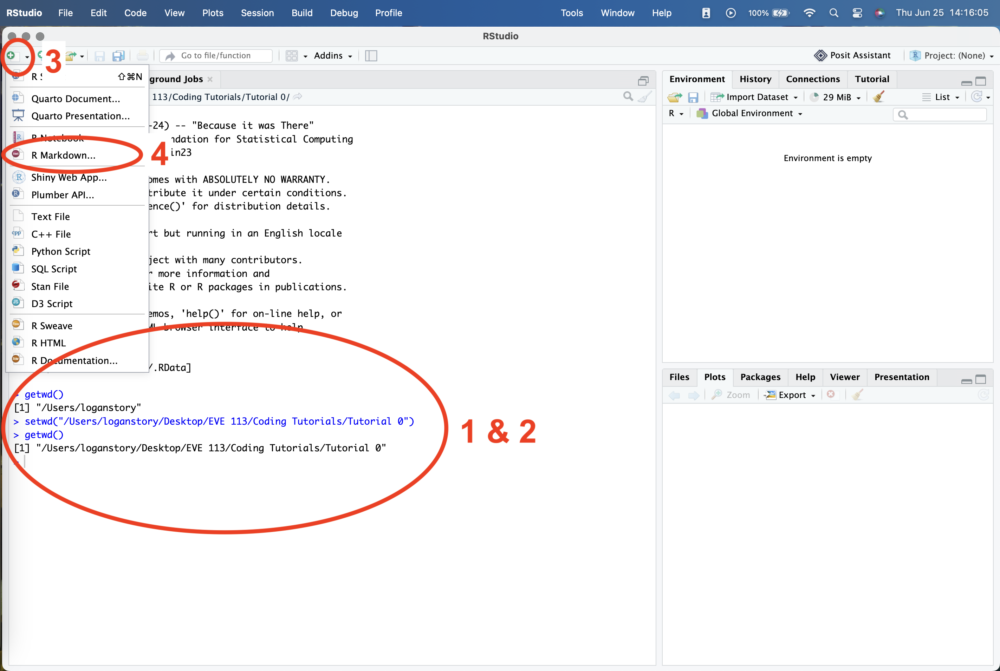{width="573"}

5.  When the document window pops up, title your new .rmd "Tutorial 0".

6.  Select your **Default Output Format**. This will be what your file will be saved as when you Knit your .rmd. Any format will do for the sake of this tutorial, but I often prefer HTML.

7.  Click **Okay**.

Your .rmd document should be created! There's already a lot of text included in the base Rmarkdown document, but some of it should help with getting oriented. Go ahead and take a minute to explore.

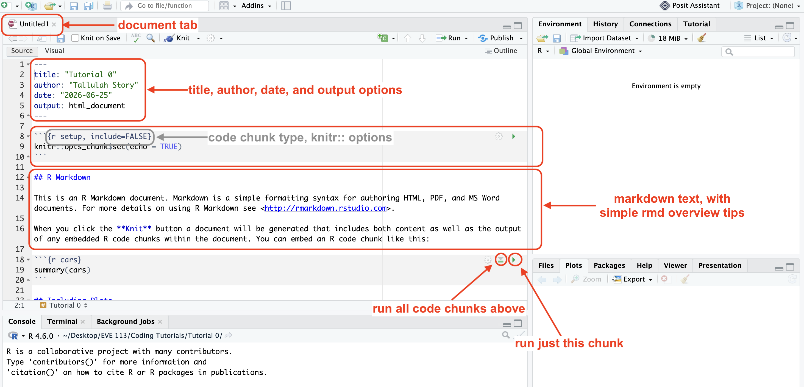

Start by pressing the green play button (which is the **Run Current Chunk** button) to the right corner of [Chunk 1]{.underline} (which begins at line 8).

::: callout-tip
**You can also run individual lines of code by pressing the '**control \^**' and '**return**' keys on your keyboard at the same time.**

If you want to run the entire chunk of code at once, you can use the **Run Current Chunk** button.
:::

The line `knitr::opts_chunk$set(echo = TRUE)` in code chunk 1 is used in Rmarkdown documents to globally configure code chunks so that the underlying source code is visible in the final rendered output.

Here, you're using the package **knitr::** to set any *outputs* you run in Rmarkdown to be included when you **knit** the final document. This code chunk is automatically included in all .rmd files you create unless you personalize your RStudio otherwise. We won't worry about this too much for now.

Scroll down to the second code chunk.

Run chunk 2. You should see a new output print diretly below your code chunk inside the code editor AND the Console.

```{r eval=TRUE}
#| message: false
#| warning: false
#| paged-print: false
summary(cars)
```

This is the output of the command `summary(cars)`.

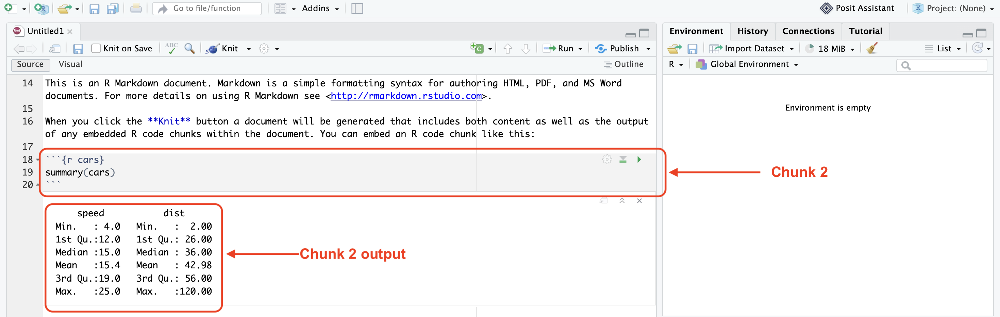

Here, `R` is providing a `summary()` of the data set `cars`.

Now you may be asking yourself, "where did this data set come from??? I don't have any data sets in my computer called `cars`." You'd be 100% correct!

You *don't* have a data set called `cars` on your computer, but RStudio *does*. This is one of the "native" data sets included in the `R` and Rstudio computing environment. These can be used to practice data manipulation and visualization and we will use a few of these throughout these tutorials.

The data gives the speed of cars and the distances taken to stop. The data was recorded in the 1920s. `cars` is data frame with 50 observations on 2 variables.

|              |                   |                        |
|--------------|-------------------|------------------------|
| **Variable** | **Variable Type** | **Unit**               |
| speed        | numeric           | Speed (mph)            |
| dist         | numeric           | Stopping distance (ft) |

We will use `cars` in this tutorial to explore adding code chunks and running individual lines of code.

In code chunk 3, there is code to produce a plot. This also makes use of another internal data set called `pressure`, which is a 2 variable data set exploring the relation between temperature in degrees Celsius and vapor pressure of mercury in millimeters (of mercury).

Run this code chunk and scroll down to look at the output.

```{r, eval = TRUE}
plot(pressure)
```

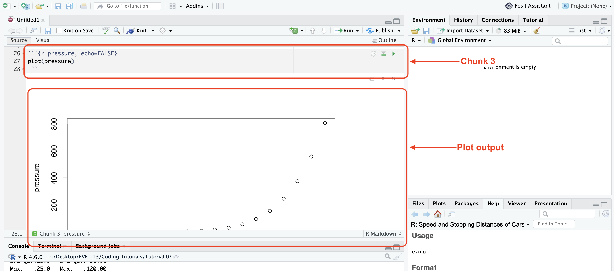

You might be quick to notice that this plot output is very large, and you have to scroll far down to even be able to view the entire thing in the code editor. As we progress in this course, we will continue adding multiple lines of code per code chunk and constantly scrolling up and down will become very tiresome very quickly.

So, whenever we generate a plot or need a summary from our code chunk output, navigating the printed results in the code editor will become cumbersome. **For the purposes of continuity in this class, we will be setting our [code chunk outputs]{.underline} to be in the *Console* instead of *inline*.**

### Setting Chunk Output to Console

1.  Click the wheel icon 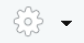{width="33"} (a.k.a. the **Format Options** button) below the file tab bar (directly to the right of the knit button).
2.  Scroll down and select **Chunk Output in Console**.
3.  RStudio will then ask you if you'd like to remove any inline chunk output you've already generated. Click **Remove Output**.
4.  Run Chunk 3 again. If you did this correctly, you should see the following: 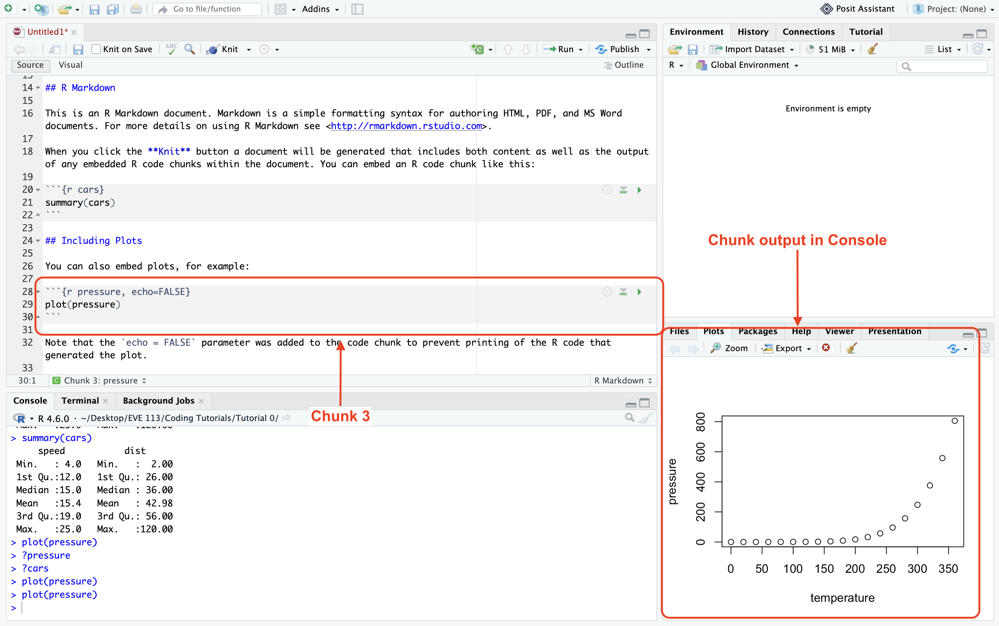

This generates your plots in the **Plot** window at the bottom right of your screen. Here you can navigate between **Files**, **Plots**, and other environmental viewers. Keep the plot tab open for now.

If you scroll back up to the top of your document you should now see the following at the top:

```{r eval=FALSE}
#| message: false
#| warning: false
#| paged-print: false
---
title: "Tutorial 0"
author: "You Name Here"
date: "Todays Date Here"
output: html_document
editor_options: 
  chunk_output_type: console
---
```

You can manually change the chunk output type by simply adding this option at the top of your .rmd manually, like above, but it's significantly easier to just do the point-and-click method.

::: {.callout-tip appearance="simple" icon="false"}
**Do It Yourself T0-2**

2a. Re-run chunk 2. Find where the new output is.

2b. We've plotted a different internal data set called `pressure`. Get a summary of `pressure` without adding a new chunk of code or adding a new line within an already existing chunk of code.
:::

## Commenting on Code

Adding comments on your code is by far one of the most important data management practices you'll develop as a scientist. Some code doesn't inherently call for comments, but it's good to get into the habit of adding frequent, descriptive comments to your code early on.

*The more comments, the better* (in my opinion, there is not such thing as too many comments on your code).

In Rmarkdown, you can also add more detailed text above and below code chunks (like the text included in our new .rmd file we've created). In this case, the text in our new document introduces you to Rmarkdown, but in the future we will use this for interpretative comments about our work.

With the code chunks we already have, lets add some comments. Go ahead and add the following comment next to `summary(cars)` then run the chunk.

```{r eval=FALSE}
#| message: true
#| warning: true
summary(cars) <- gives a summary of the native data set cars
```

...that doesn't work. When you run this, you should receive the following error:

> Error: unexpected symbol in "summary(cars) \<- gives a"

This means your code is *not able to run* because `R` encountered an *unexpected symbol* in the text you added to the chunk. That's because `<-` is an actual **argument** in the `R` programming language.

Additionally, there is no such command as `gives` in `R`.

The moment `R` recognizes something wrong in your code, it won't run and it will return an **error** or a **warning** message.

::: callout-tip
**It is always best practice to ensure all of your code runs without any errors or warnings before submitting for a grade.**

A good way to check if your code is running completely without errors or warnings is by scrolling all the way to the bottom of your .rmd and running all the chunks above it. Everything should run synchronously.
:::

So, how can we add a comment to our code if we can't do it that way?? Let's try something else:

```{r, eval=FALSE}
#| message: false
#| warning: false
#| paged-print: false
summary(cars) "gives a summary of the native data set cars"
```

Huh... Using quotes around our comment doesn't work either?? When you do this, you'll receive the error message:

> Error: unexpected string constant in "summary(cars) "gives a summary of the native data set cars""

That is because `R` is not able to recognize the constraint `"gives a summary of the native data set cars"` as a part of the code evaluation `summary(cars)`.

Let's try one more thing... Go ahead and edit chunk 2 with the following:

```{r, eval = FALSE}
summary(cars) # gives a summary of the native data set cars
```

Yay!!! It works!!!

Using a preemptive `#` before your comment text will turn your comment a different color and `R` will ignore any text included to the right of it.

If you press enter to a new line of code, you will need to add another `#` before any additional comments you make. Essentially, what R is doing is it's reading what you've typed into any code chunk left to right. When it encounters a `#`, it reads past it until a new line of code begins.

::: {.callout-tip appearance="simple" icon="false"}
**Do It Yourself T0-3**

3a. Add comments to chunk 3 to describe what the command `plot()` is doing.
:::

## RMarkdown Chunk Options

At the end of the document on line 32 (or 33 if you've been completing the DIYs as we've progressed) there is the following text explaining the code chunk options.

::: callout-note
The `echo = FALSE` parameter was added to the code chunk to prevent printing of the R code that generated the plot.
:::

RMarkdown **parameters (or chunk options)** allow you to alter *individual chunks of code* to alter the **code output** in some manner when you knit your final document.

For the purposes of this course, we will only really care about `eval`, `include`, and `echo`, but know that many (many) more chunk options exist. To find more ways to edit or alter you code chunks, visit [this cheat sheet](https://www.rob-mcculloch.org/R/rmarkdown-cheatsheet-2.0_from-rstudio-2019-1-7.pdf). Chunk options come with an operative argument (like `eval`) and a conditional statement (like `TRUE` or `FALSE`).

Here's a quick guide to what these mean below:

| Option | Function |
|------------------------------------|------------------------------------|
| `eval` | dictates whether a code block is actually executed when you render, knit, or compile your document. |
| `include` | controls the visibility of a code chunk's output in your final rendered document. |
| `echo` | controls whether the source code itself appears in your final rendered document. `echo = numeric` will select specific lines of code to display (e.g., `echo = 1:2` displays source code lines 1 through 2). |
| `warning` | hides or shows package and system warning messages. `TRUE` (Default) displays warning boxes. |
| `error` | configures how the document compilation responds to failing code. `FALSE` (Default) halts compilation immediately if a code error occurs. |
| `message` | suppresses text notifications like library startup alerts. `TRUE` (Default) shows messages associated with your code. |
| `cache` | stores code chunk results to optimize future document rendering. `FALSE` (Default) will re-run every line of code every time you compile or knit your document. |

::: callout-note
Default chunk options are usually `TRUE` (unless I've specified otherwise above).
:::

**To add a chunk option you should:**

1.  Place your cursor directly into the code brackets after the `r`:

> ```` ```{r} ````

2.  Add a comma after r.

> ```` ```{r, } ````

3.  Add a chunk option.

> ```` ```{r, echo=TRUE} ````

4.  To add multiple chunk options, simply add a comma after every option.

> ```` ```{r, echo=TRUE, include=FALSE} ````

## Adding a Code Chunk in RMarkdown

Now to add your very own chunk of `R` code into your new .rmd file!!

1.  Make some space at the bottom of your current .rmd file. One or two lines should be good.

2.  Select the **Insert a new code chunk** 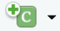{width="33"} icon in the menu.

3.  Select **Insert a new R chunk**. 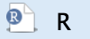{width="34"}

    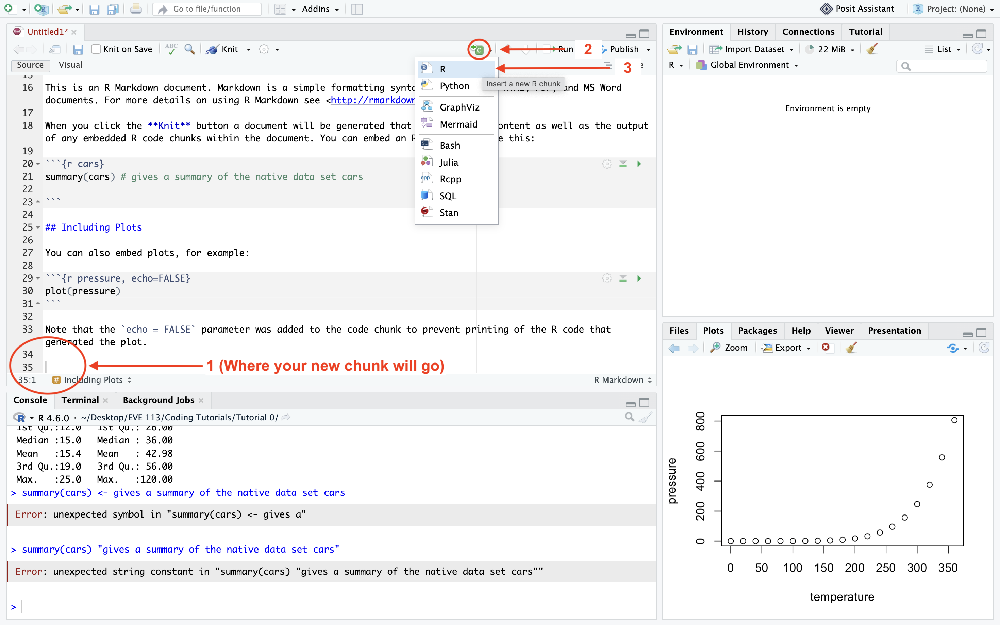{width="550"}

You should now have your very own chunk of R code ready for use.

::: {.callout-tip appearance="simple" icon="false"}
**Do It Yourself T0-4**

In your Brand New Code Chunk™ ...

4a. Plot the `cars` data. What is the x axis? What is the y axis?

4b. Add a comment to your `cars` plot code.

4c. In this chunk, configure the options so it includes your plot in the final knitted document, but doesn't include the source code.
:::

## Saving and Knitting Your RMarkdown File

Finally, to save your RMarkdown document, navigate to the menu and press the 'Save' icon.

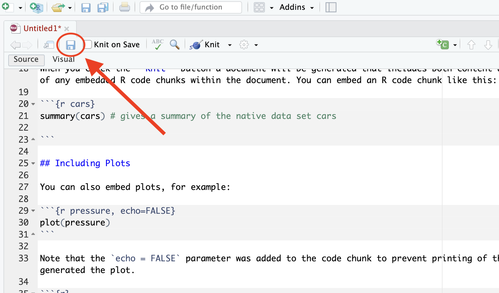

If you set your working directory correctly at the beginning of this tutorial, you will be directed to save your Untitled.rmd in the folder you set as your working directory

> (e.g., `/Users/yourusername/Desktop/EVE 113/Coding Tutorials/Tutorial 1`).

Now, when we turn in assignments in this course, you will need to knit your code to save it as the output type you set at the beginning of this tutorial when you first made the Rmarkdown file.

1.  Locate the **Knit** icon (which is next to the Settings wheel and literally looks like a little ball of kitting yarn).

2.  Click **Knit**. 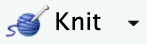{width="50"}

3.  You will be redirected to the knitted version of your code.

4.  In this case, I set my output type as HTML, so it will redirect me to a HTML file including all of the text and configured code chunks within the original .rmd file. It (should) look something like this:

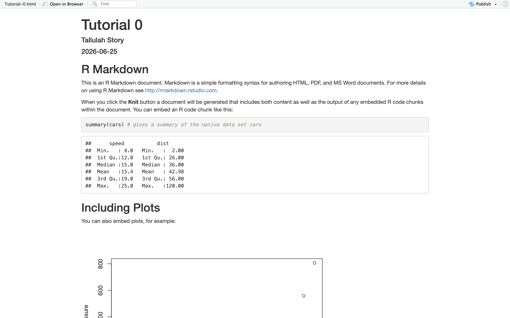

## Review

Wowie! That was a lot! If you've made it to the end of this, CONGRATS! You now know how to start coding in RStudio. Give yourself a HUGE pat on the back because learning the basics to `R` and Rmarkdown are by far the hardest parts of learning how to code in `R`.

However, I'm confident these essentials will give you the foundational knowledge you will need to succeed in this course. And I can (hopefully) promise once you master these skills, learning how to use RStudio to your advantage will only get easier from here.

To review, you should be able to:

1.  Navigate the RStudio computing environment, including describing where the Console is.
2.  Set a working directory and explain the difference between an absolute and relative path.
3.  Create, edit, and save Rmarkdown files.
4.  Edit chunk options in a Rmarkdown file.
5.  Understand how to comment on your code.
6.  Provide a summary on a data set.
7.  Plot a simple, 2 variable data set.

If you find you are unable to do one or more of the above tasks, go ahead and take some time to review this tutorial again until it starts to make sense. Happy coding!

{width="200"}
