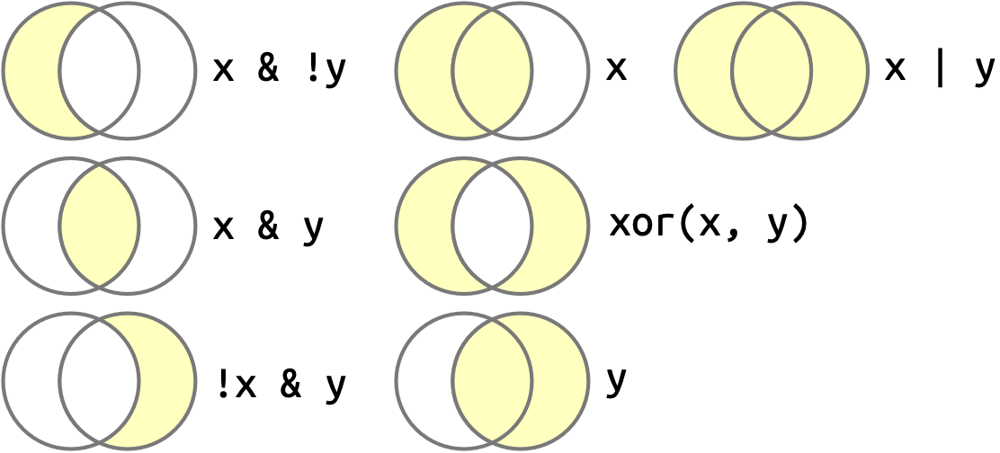

```{r, echo=FALSE}
#| message: false
#| warning: false
#| paged-print: false
library(palmerpenguins)
library(tidyverse)
library(dplyr)
library(ggplot2)
```

# Introduction to the Tidyverse


In this class, we will be using a suite of packages known as the tidyverse. These packages were originally developed by Hadley Wickham and Garrett Grolemund as a new approach to using R. Since it's widespread use and continued development, the tidyverse has made R more user friendly and more flexible for the purposes of data science. By the end of this tutorial, my goal is to familiarize you with the tidy workflow and the commands that will allow you to work with your own data.

To complete this tutorial, use the "R Prep.rmd" file located on the class canvas page. This tutorial will go between learning skills with examples and setting up the questions in that assignment. **Your R Preparedness assignment is due August 27th prior to our first data workshop day.**

## Learning Objectives

1.  Be able to manually import a .csv file.
2.  Understand variables, vectors, and logical operators.
3.  Explore, filter, and transform using dplyr.
4.  Generate plots with ggplot.

## Install Packages and Import Data

For this tutorial you are expected to already know how to create a new .rmd file, get your working directory, and set your working directory. If you are not able to do so, return to Tutorial 0 for a quick review on these skills.

::: callout-important
To start, ensure your `R-Prep.rmd` file is in your **Coding Tutorials** folder. If you do not have a coding tutorials folder, make a folder path on your computer like the following: `/yourusername/Desktop/EVE 113/Coding Tutorials`.

Alongside answering assignment questions in the R-Prep assignment, I would also like you to create your own Rmarkdown file called `Tutorial 1.rmd` to follow along as you work through this tutorial. Do not do work for your R Preparedness assignment in your tutorial 1 file. Instead use this file as a way to test your skills.

**Write your final answers for the assignment is the** `R-Prep.rmd` **only.**
:::

In this tutorial we will be using the package `palmerpenguins` as well as an example data set provided on the class canvas page. Palmer penguins is a CRAN data set provided that is a better alternative to the `iris` data set. If you'd like to know more about why we won't be using `iris` in this course, you can [read more here](https://medium.com/data-science/the-iris-dataset-a-little-bit-of-history-and-biology-fb4812f5a7b5).

[Palmer penguins](https://allisonhorst.github.io/palmerpenguins/) is a data set including size measurements, clutch observations, and blood isotope ratios for adult foraging Adelie, Chinstrap, and Gentoo penguins observed on islands in the Palmer Archipelago near Palmer Station, Antarctica.

First, install palmerpenguins into your local environment by using the command `install.packages()`.

```{r, eval = FALSE}
install.packages("palmerpenguins")
```

When installing multiple packages at once, you will use something known as a **character vector** **combine** ( `c()` ) followed by the list of packages you're installing.

```{r, eval = FALSE}
install.packages(c("package1", "package2", "package3", "package4"))
```

The packages are now installed, but not currently active in our library. To make the packages usable and active in our current session, we use the `library()` command.

```{r, eval = FALSE}
library(palmerpenguins)
```

::: callout-tip
To keep things neat and tidy, I suggest **using one R chunk to complete your "setup" (i.e., package installation, library imports, and other global options you set in your script)**. It would look something like this in your .rmd file:

```{r setup, eval = FALSE}
# gloabl chunk options (example)
knitr::opts_chunk$set(echo = TRUE)

# getting and setting working directory. Always double check if this worked
getwd()
setwd("/Users/yourusername/Desktop/EVE 113/Coding Tutorials/Tutorial 1")
getwd()

# install packages 
install.packages(c("package1", 
                   "package2", 
                   "package3", 
                   "package4")
                 )

# load multiple packages at once
my_packages <- c("package1", # perhaps note what this package is used for
                   "package2", # bwt these are not real packages
                   "package3", # don't try to actually install them
                   "package4") # (HINT: it won't work)
lapply(my_packages, library, character.only = TRUE)

```
:::

Try it yourself: Create a new chunk and name it "data import". In this class, we will save our data sets as .csv files (comma separated files). As scientists, we may use Excel or Google Sheets to input data, but it is best practice to save individual data sets as .csv files for simple, easy importing. To read a .xls file into R, you would need to install a third party package which adds an additional computing step during set up.

Navigate to our class canvas page. Go to **Files** and open the **Coding Tutorials** folder. Download the metadata_tidepool.csv file and save it in your **Coding Tutorials** folder. If you've properly set your working directory and saved the file to the correct location, this next step will be easy.

Import your .csv data set using the `read.csv()` command and saving it in a **data frame object** called 'data'.

```{r, eval = FALSE}
data <- read.csv("metadata_tidepool.csv", header = TRUE)
```

The argument `header = TRUE` will ensure that when you import your .csv, R is treating the first row of your data as column names. You would set this as `header = FALSE` if your data set did not contain column names.

Great, now we have two different data sets to play around with. Let's start with Palmer penguins.

::: {.callout-tip appearance="simple" icon="false"}
**Question 1**

1a. Get and set your working directory based on the suggested file path in Tutorial 0.

1b. Install the Palmer penguins data set onto your computer.

1c. Import the tidepool metadata practice data set.
:::

## Exploring Your Data Frame Object

It's good practice to ensure that when you import a new data frame into your computing environment, you ensure everything looks approximately as it should (i.e., variable names are included and correct, variable types seem accurate to your data, and number of observations is approximately accurate).

This is simply done with three commands that I suggest you always run when first importing data into `R`: `summary()`, `head()`, and `tail()`.

```{r}
summary(penguins)
```

`summary()` is a generic function used to provide overall summaries of objects or models.

```{r}
head(penguins)
tail(penguins)
```

`head()` returns the first parts of a vector, matrix, table, data frame, or function. `tail()` returns the last parts of the object.

::: {.callout-tip appearance="simple" icon="false"}
**Question 2**

2a. Retrieve the summary, head, and tail of the tide pool metadata set.

2b. What's the mean tidepool volume?

2c. How many rows does the tidepool metadata set have?
:::

## Values, Variables, and Vectors

Looking at the summary of `penguins` reveals this is an 8 variable data frame: 3 categorical variables (species, island, sex), 4 numeric variables (bill_length_mm, bill_depth_mm, flipper_length_mm, body_mass_g), and 1 integer variable (year).

To check what kind of variable is contained within a data frame object, you use the `class()` command.

```{r, eval = FALSE}
# syntax example of class()
class(dataframe$variableofinterest)
```

The command is broken down as `class(x$variable)` where `x` is the data frame object you're inspecting, `$` is the extraction operator of x, and `variable` is simply the name of the variable you're extracting from x.

```{r}
class(penguins$species)
```

This returns the class of the variable species extracted from the `penguins` data frame. You should see "factor" in your own .rmd, like above.

It's important you understand and can differentiate between the **atomic data types** you might encounter when using R. However, for this class and likely beyond, you'll only really need to focus on the first four.

| Type | Description | Example Value | `class()` Output | Common Use Case |
|----|----|----|----|----|
| Numeric | Default for all real numbers; Can be continuous or discrete. | `10` or `2.1415` | "`numeric`" | Continuous measurements, math calculations |
| Integer | Whole numbers explicitly defined. | `7L` or `year` | "`integer`" | Discretely counted numbers, IDs, loops, dates |
| Character | Text strings wrapped in single or double quotes, categorical variables with no numerical value. | "`hello`" or "`yes`" or "`female`" | "`factor`" | Names, descriptive labels, text data |
| Logical | Boolean states representing truth values. | `TRUE` and/or `FALSE` | "`logical`" | Filtering data, evaluating conditions |
| Complex | Numbers containing real and imaginary components. | `3 + 2i` | "`complex`" | Purely mathematical or signal functions. |
| Raw | Unprocessessed binary data stored ad individual bytes. | `as.raw(43)` | "`raw`" | Reading binary files or protocol streams. |

In R, we have [values]{.underline} (the data), [vectors]{.underline} (the container), and [variables]{.underline} (the names).

**Values** in R must belong to an atomic data type (like the six types above).

**Vectors** are an ordered collection of values. Vectors are *homogeneous*, meaning all values inside a single vector must be of the same type.

- To create a vector you combine values using the `c()` (combine) function.

- If you mix data types, R forces lower types into higher types (`Logical < Integer < Double < Character`) without throwing an error.

  - For example, `c(5, "Hello")` forces the numeric `5` to become a factor `"5"`.

- Access specific elements of a vector by using square brackets `[]`. R uses 1-based indexing, so the first element is at position `1`.

```{r}
# create a numeric vector
ages <- c(15, 20, 25, 30)

# extracting the second element follows 1-based idexing
ages[2] # should return 20
```

**Variables** are the "labeled boxes" of your data. When you write code, you use the assignment operator `<-` to bind a name (the variable) to a data object (like a vector).

- While the equals sign `=` works for assignment, `<-` is preferred (and the widely recognized standard for assignment).

- Variable names are case- and space-sensitive (`my_data` is different from `My_Data` or `my_ data`).

- Assigning a new value to an existing variable overwrites its previous contents.

```{r}
fruits <- c("apple", "cherry", "blueberry")
print(fruits)
```

```{r}
# assigning a new value will un-write the previously assigned content of "fruits"
fruits <- c("lettuce", "carrots", "celery") 
print(fruits)
```

We use the `print()` function to give the output or generate the contents of a vector or object into the R Console.

All R statements where you create objects , assignment statements, have the same form: `object_name <- value`. Again, don't use `=`. It's just confusing.

::: callout-tip
Getting tired of continuously, manually typing `<-` ? Well, you're just in luck!! Statisticians and those who use R agree with that sentiment, so there's actually a keyboard shortcut! Just type **Alt** + **-** and voila! You're very own assignment argument.

This is also great because `R` automatically gives you spaces on both sides of the assignment arrow, which (again) is good coding practice and etiquette. Code is miserable to read on a good day, so giveyourselfabreakand [***use spaces***]{.underline}.
:::

This harkens to the code etiquette tab, but please ensure you're giving your assigned objects, vectors, data frames (or literally everything else) a descriptive name. In this course, I'd like you to use `snake_case`, where you will separate lowercase words of a named object with `_`.

```{r, eval = FALSE}
i_use_snake_case
otherPeopleUseCamelCase
some.people.use.periods
And_aFew.People_RENOUNCEconvention.like_fre_AKS
```

Sometimes the data you have doesn't match your coding conventions. Our tide pool meta data mixes `snake_case` and `camelCase`. This is a very common issue and often happens with data sets that include multiple contributors.

It is best practice to *agree* and *stick to* a single convention when collaborating. To maintain continuity, you can rename variables using your agreed-upon convention.

For us, this convention is `snake_case`. To do this, you can use `dplyr` or base R. We'll learn more about `dplyr` in a moment, but for now lets learn how to do this in base R.

```{r, eval = FALSE}
# explicit name matching in base R to re-name data frame variables
names(data) [names(data) == "Old_Column_Name"] <- "new_column_name"

####OR####

# rename ALL columns all at once
names(data) <- c("column_1", "column_2", "column_3", "column_4")
```

::: {.callout-tip appearance="simple" icon="false"}
**Question 3**

3a. What is the atomic data type of tide pool size? How many tide pool sizes are there?

3b. Rename the tidepool metadata object (if you haven't already) using `snake_case` convention.

3c. Rename all variables in your new tide pool data frame to match `snake_case` conventions.
:::

## Data Transformation with dplyr

If you've noticed the double semi-colon after certain names of things (e.g., `knitr::` , `ggplot::` , `dplyr::`) this is an easy indication I am talking about a **package**.

When installing packages that overwrite previously installed or loaded packages in R, but you still want to use those functions, you'll need to specify what package relates to what function. The two most common conflicts are two functions from the `stats::` package (which is pre-loaded in base R):

```{r, eval = FALSE}
stats::filter()

stats::lag()
```

If you receive conflict messages when running `filter()` or `lag()`, it's likely because you've overwritten one or the other with either `stats::` or `dplyr::`. Use the package that correlates to the command you're trying to execute by indicating so with `::`.

### Install and Load dplyr

To transform our data, we will be using the `dplyr` package, which is a small component of the tidyverse package suite. If you haven't done so before, install and load the `tidyverse` and `dplyr` packages in your setup chunk.

```{r, eval = FALSE}
install.packages(c("tidyverse", "dplyr"))

# load multiple packages at once
CRAN_packages <- c("tidyverse", "dplyr")
lapply(CRAN_packages, library, character.only = TRUE)
```

CRAN packages are add-on modules written for `R` by other programmers. `lapply()` applies your vector `CRAN_packages` using the `library()` function, ensuring `R` passes your string of variables (your packages) in your vector as actual package names R will recognize. This allows you to load multiple packages at once without having to retype `library()` over and over.

::: {.callout-tip appearance="simple" icon="false"}
**Question 4**

Use code to install the tidyverse and dplyr packages; Load the packages into your working session.
:::

### dplyr Basics

There are five key functions that make `dplyr` extraordinarily valuable for data visualization and transformation.

1.  Pick observations by their values using `filter()`
2.  Reorder rows with `arrange()`
3.  Pick variables by their names with `select()`
4.  Create new variables with functions of existing variables using `mutate()`
5.  Collapse many values down to a single summary with `summarize()`

These commands are often used in conjunction with `group_by()`, which changes the scope of each function by going group-by-group, if desired. All of these functions together provide the verbage of data manipulation. All of the verbs (functions) work similarly where:

1.  Argument one is the data frame.
2.  Subsequent arguments describe what you'd like to actually do with the data.
3.  The result is saved in a new data frame.

Do these things and you can successfully manipulate any data frame.

### Filter Rows with filter()

`filter()` subsets observations based on their values followed by a logical operator that you provide. For example, say I want to only look at Chinstrap penguin measurements from 2007.

```{r}
filter(penguins, species == "Chinstrap", year == 2007)
```

`dplyr` functions never permanently modify their inputs, so if you want to save the result, you'll need to use an assignment `<-` operator.

```{r}
chinstrap_2007_df <- filter(penguins, species == "Chinstrap", year == 2007)
```

R will either print out the results if you explicitly ask using `print()`, or save them into a variable without printing. If you want to print and save it, wrap the entire argument in parentheses.

```{r}
(chinstrap_2007_df <- filter(penguins, species == "Chinstrap", year == 2007))
```

To filter effectively, you need to understand how to correctly select comparison and logical operators. R gives you quite a few:

- `>`, greater than

- `>=`, greater than or equal to

- `<`, less than

- `<=`, less than or equal to

- `!=`, not equal to

- `==`, equal to

Boolean operators combine comparisons and logical operators when you'd like to filter multiple things at once. This is where filtering is the most confusing. Even after 4 years of using `dplyr` consistently, I am still struggling to understand this. So, I am under no expectation that you are to master this, I am simply giving you this information, and you may do with it what you'd like.

Boolean Operations are as follows:

- & is "and"

- \| is "or"

- ! is "not"



Say, for example I'd like to find penguins that were measured in 2007 or 2008.

```{r}
filter(penguins, year == 2007 | year == 2008)
```

This reads in plain English as "find all penguins measured in year 2007 or year 2008". You can also simplify if you're filtering the data frame by the same variable by using `x %in% y`.

```{r}
filter(penguins, year %in% c(2007,2008))
```

Or for character variables...

```{r}
filter(penguins, species %in% c("Chinstrap", "Adelie"))
```

What if I'd like to do more complicated sub-setting? For example, I'd like to filter for every penguin that isn't a Adelie and Chinstrap penguins and that have bills \<40mm.

```{r}
filter(penguins, !(species %in% c("Adelie", "Chinstrap") & bill_length_mm > 40))
```

When filtering, you can simplify by remembering that:

1.  !(x & y) is the same as !x & !y
2.  !(x \| y) is the same as !x & !y

### Missing Values

Filtering and using comparison operators is often tricky when values are missing. NA represents an unknown value. Unknown values are contagious, and any operation or command that requires all values won't run when values are missing. For example:

```{r}
# let x be Penelope's age. Sadly, we have no idea how old Penelope is.
x <- NA

# let y be Jack's age. We also don't know how old Jack is. Bummer.
y <- NA

# Are Jack and Penelope the same age?
x == y
# We don't know because Jack and Penelope's ages are NA's!!!!!
```

If you'd like to know if a value is missing, use `is.na()`.

```{r}
is.na(x)
```

Filtering data will only include rows where the condition of `is.na()` == FALSE.

```{r}
fake_data <- tibble(x = c(1, NA, 3))
filter(fake_data, x > 1)
```

But perhaps we'd like to include all rows, even if they have NAs, then you'd explicitly ask `R` to do so.

```{r}
filter(fake_data, is.na(x) | x > 1)
```

::: {.callout-tip appearance="simple" icon="false"}
**Question 5**

5a. Filter the tide pool data to only include large tide pools with a macro_richness that is \>= to 10.

5b. Filter the Palmer penguins data set to only include male penguins that were measured in every year except 2007 on Biscoe island (HINT: try using the ! logical operator to exclude 2007).
:::

### Arrange Rows with arrange()

`arrange()` changes the orders of rows, which can be useful when plotting or doing ranked statistical analyses.

```{r}
arrange(penguins, bill_length_mm, bill_depth_mm)
```

`arrange()` automatically sorts the values of bill_length_mm and bill_depth_mm in ascending order. If I wanted these variables to be in descending order, I'd specify with `desc()`.

```{r}
arrange(penguins, desc(bill_length_mm), desc(bill_depth_mm))
```

If you provide more than one column when arranging, each additional column will be used to break ties in the values of preceding columns. Above, we've arranged penguin observations by largest bill length, further sorted by largest bill depth. See what happens to the first few rows when we instead sort by bill_depth_mm first.

```{r}
arrange(penguins, desc(bill_depth_mm), desc(bill_length_mm))
```

Two Adelie observations have the same value for bill_depth_mm, therefore arrange will then "rank" the individual by the other specified column in arrange.

Missing values are always sorted at the end:

```{r}
tail(arrange(penguins, desc(bill_depth_mm), desc(bill_length_mm)))
```

::: {.callout-tip appearance="simple" icon="false"}
**Question 6**

6a. How could you use `arrange()` to sort all missing values to the start? (HINT: try using `is.na()`).

6b. In the tide pool data frame, arrange our observations in descending order by the Macro-organism Shannon mean and the Macro-organism richness.
:::

### Select Columns with select()

Its not uncommon to receive data sets with hundreds or maybe even thousands of variables. Working with a data frame that dense is computationally expensive, so sub-setting down to the variables of interest is best practice when dealing with data like this. `select()` gives you the power to accomplish this.

```{r}
# select columns of interest
select(penguins, species, island, sex, year)

# select all columns between species and flipper_length_mm
select(penguins, species:flipper_length_mm)

# select all columns except those from species to flipper_length_mm
select(penguins, -(species:flipper_length_mm))
```

I often use `select()` to make my data transformations more exclusive in a sub-set. I will ask you to select variables when preparing for statistical analyses, to prevent influence or leverage from unwanted values in your analyses.

Additional helper functions that come along with `select()` include:

- `starts_with("abc")` would match names that begin with "abc".

- `ends_with("xyz")` would matches names that end with "xyz".

- `contains("ijk")` would match names that contain "ijk".

::: {.callout-tip appearance="simple" icon="false"}
**Question 7**

7a.

7b.
:::

### Rename Columns

Remember earlier when I showed you how to rename your columns using base R? Well, like I said, you can also do that with dplyr using the command `rename()`!

```{r, eval = FALSE}
rename(example_data, old_col_name1 = new_col_name1, old_col_name2 = new_col_name2)
```

::: {.callout-tip appearance="simple" icon="false"}
**Question 8**

8a. Re-import the tidepool metadata set. What effect does this have to the work we've already done to the data set?

8b. Re-name the tidepool data frame object using `snake_case` once again (if you didn't already do so during re-import). Using dplyr and the `rename()` command, rename all the columns in the tidepool metadata using `snake_case`.
:::

### Add New Variables with mutate()

Adding new columns or variables that are functions of existing columns is exactly where mutate() comes in.

```{r}
# create a smaller sub-set of data to work with
penguins_reduced <- select(penguins, species, bill_length_mm, bill_depth_mm)

# mutate to add column that calculates bill volume (BTW this is not a real measurement metric that opthimologists use, just an example I'm using for this)
mutate(penguins_reduced,
       bill_volume = bill_length_mm * bill_depth_mm)
```

The `*` is the multiplication mathematical operation we use in R. Other mathematical operations you might encounter include:

- `-` = subtraction

- `/` = division

- `+` = addition

- `sqrt()` = square root

- `log()` = log

### Group Summaries with summarize()

Retrieve mean, medians, standard deviations, standard errors, and more with `summarize()`. Run the code below.

```{r}
summarize(penguins, mean_bill_length_mm = mean(bill_length_mm))
```

Ruh roh... Okay that went wrong fast. Well, do you recall when I was talking about how missing values can muck up your code earlier in the tutorial? Well the `penguins` data frame includes a few rows that have `NA` observations. To run summaries that include rows with NAs, use `na.rm = TRUE`.

```{r}
summarize(penguins, mean_bill_length_mm = mean(bill_length_mm, na.rm = TRUE))
```

`na.rm = TRUE` tells `R` to remove any missing values prior to computation. You could also leverage `filter()` to simply exclude any rows with NA observations prior to computation.

```{r}
penguins_no_na <- filter(penguins, !is.na(bill_length_mm))

summarize(penguins_no_na, mean_bill_length_mm = mean(bill_length_mm, na.rm = TRUE))
```

`summarize()` can do quick, general calculations for you, or can be used in tandem with `group_by()` to get grouped summary stats.

```{r}
penguins %>% 
  group_by(species) %>%
  summarize(species_bill_means = mean(bill_length_mm, na.rm = TRUE))
```

Okay, now if you've never seen a pipe before (or have no idea what a pipe even is (and no I don't mean like the plumbing type of pipe)), this might look like complete and total gibberish. **However, I think this is the most valuable skill I want you to take away from this tutorial: stringing together commands with pipes** `%>%`.

### Combining Multiple Operations with the Pipe

Imagine that I'd like to get the mean of bill length and bill depth by species on each island from 2007 and 2008. You could do this step-by-step by:

1.  selecting variables of interest
2.  filtering out observations from 2009
3.  grouping by species and island
4.  summarizing your variables

Doing it like this is why people might come to hate coding, because this would be time intensive and yield a higher risk of making an up-stream mistake that would don't catch until the very end. However, what if I told you all of this can be done in one consecutive "line" of code? Take a look at the following:

```{r}
penguins_bills <- penguins %>%
  select(species, island, bill_length_mm, bill_depth_mm) %>%
  filter(!is.na(bill_length_mm)) %>%
  group_by(species, island) %>%
  summarize(mean_length = mean(bill_length_mm),
            mean_depth = mean(bill_depth_mm))
```

You should read this code as a series of interpretive statements: using the penguins data set select the variables **then** filter the NAs **then** group by the categories of interest **then** summarize. A pipe follows every primary command you're asking `R` to compute, stringing them all together as one whole operation and saving it in a new data frame. You use pipes sequentially (left to right, top to bottom) which means you can un-write or over-write previous work in the same pipe string. Don't do this. This is bad code practice. I will be sad.

**Working with the pipe is one of the key features of the tidyverse that make it so powerful.** The only exception to this, however, is `ggplot2`, which was written before the pipe was discovered. However, you can still string together piped, `dplyr` operations when plotting in ggplot2. I'll show you how to do that next as we learn...

## How to Plot and Visualize Data with ggplot2
