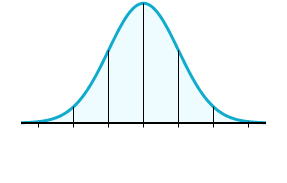
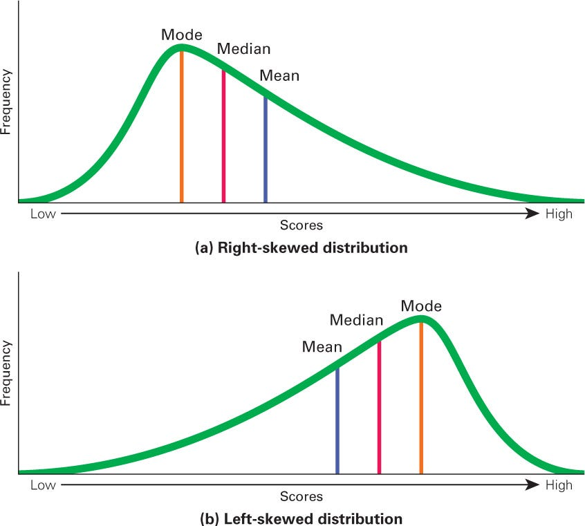

```{r, echo = FALSE}
#| message: false
#| warning: false
#| paged-print: false
library(palmerpenguins)
library(tidyverse)
library(dplyr)
library(ggplot2)
library(car)
library(broom)
library(rstatix)
```

# Applied Statistical Analyses in R


<<<<<<< HEAD
- common statistical analyses

- data types

- common stats verbage

- decision tree for choosing tests

- tests

  - t-test

  - chi square

  - one way ANOVA

  - 
=======
Statistical analyses are powerful tools we, as ecologists, can leverage to better explain our data. When we perform statistical analyses, we can describe trends, significance, and make quantitative conclusions about our data.

Nowadays, we often rely on what is described as "modern classical statistics" to achieve all of the things I mentioned above. Classical stats covers topics such as estimation, quantification of uncertainty, and hypothesis testing. However, since computers came along, there is a lot of development to stats that has yet to break its way into most learning environments - if at all. Here, the goal of this tutorial is to familiarize you with applied statistical analysis in R, choosing which tests to perform with your data, and the code needed to do so. **This tutorial will not cover in-depth the mathematical or theoretical basis for many statistical tests.** Instead, the goal of this tutorial is for you to be able to diagnose your data, pick an appropriate statistical test given those diagnostics, and be able to write code to produce an output.

By the end of this, you should be able to look at your data set and begin to make specific, meaningful choices about how to leverage these tools to make quantitative conclusions about your own data.

## Learning Objectives

1.  Learn what normality, homo/heteroscedasticity, and outliers are (and how to check for them).

2.  Understand a stats test decision tree and apply it to your own hypotheses.

3.  Compute confidence intervals.

4.  Run hypothesis tests.

5.  Use parametric and non-parametric analyses (ANOVA, Kruskal-Wallis, etc.).

6.  Perform a simple linear regression.

### Setup and Required Packages

Start a new .rmd document, name it Tutorial 2, and save it somewhere in your local operating system.

Once again, we'll be using the `palmerpenguins` package as an example ecological data set while we work through this tutorial. Information about the data can be [found here](https://allisonhorst.github.io/palmerpenguins/), if you're curious. Like in Tutorial 1, we need to load this data into our working session if we want to be able to use it.

```{r, eval = FALSE}
#| message: false
#| warning: false

install.packages("palmerpenguins")   # install this if you have not already
library(palmerpenguins)              # load the package into your working session

penguins <- penguins                 # save the data into a vector object, now accesible in your enviornment window
```

During this tutorial we'll use the various continuous, numerical variables and categorical variables in the penguins data to apply the concepts and ideas being introduced. We also need to install and load some additional packages that will make conducting our tests and analyses much easier.

```{r, eval = FALSE}
install.packages(c("tidyverse", "car", "broom", "rstatix")) # install new packages, if you haven't already

# load all packages into working session
library(tidyverse)                   
library(car)                        # functions and tools for linear regression(s)
library(broom)                      # converts stats objects to tidy tables
library(rstatix)                    # a pipe-friendly alternative to the base R stats package
```

Some people may choose to use functions provided by the base R `stats` package. This is a fine alternative, but for the purposes of this tutorial, we will be using commands and coding conventions associated with the `rstatix` package (as a pipe-friendly alternative to the stats package). Some commands will be run from the stats package. When doing so, I'll specify this beforehand.

## Diagnosing your data

Before we even begin picking out statistical tests, we need **to understand the properties our data possess**. The three most important things to know about our data, especially when it comes to statistical analyses are [normality], [Homoscedasticity (equal variance)], and [Outliers]. These three basic parameters determine whether you should opt for parametric, classical tests, or use non-parametric analyses.

### Normality

**Normality** tells us that our [data is normally distributed]{.underline} (i.e., following a bell-shaped, symmetric distribution). It's just our luck that, as ecologists, it is not uncommon for our data to be non-normal (womp womp). Many classical tests (t-tests, ANOVA, Pearson correlation, linear regressions) assume that the residuals of our a model follow a normal bell-shaped curve/distribution.



We can check for normality visually using a simple histogram.

```{r}
#| warning: false
ggplot(data = penguins, aes(x = bill_length_mm)) +
  geom_histogram()
```

The variable `bill_length_mm` has a bi-modal distribution. This means that there are two primary peaks where our data values are clustered along the x-axis. Already, this means the variable (and underlying distribution) of `bill_length_mm` is non-normal. What about `body_mass_g`?

```{r}
#| warning: false
ggplot(data = penguins, aes(x = body_mass_g)) +
  geom_histogram()
```

This variable appears to have a more uni modal, bell-shaped distribution, where the data values are clustered in a visible center. This variable *might* be considered normal. However, this distribution is slightly skewed, meaning that the uni modal center of the data sits to the **left** or the **right** of the x-axis limits.

{width="554"}

We can draw a smoothed curve over our histogram to better visualize this skew using the command `after_stat` combined with a geom call of density...

```{r}
#| message: false
#| warning: false
ggplot(data = penguins, aes(x = body_mass_g)) +
  geom_histogram(aes(y = after_stat(density))) +
  geom_density(color = "red", linewidth = 2)
```

This draws and empirical, smoothed normality curve over out data. But, you can see how messy this quickly becomes when trying to evaluate large, variable data sets. We can also diagnose normality using a Q-Q plot (also known as a quantile-quantile plot). It's often much more informative than a histogram and more representative of the true normality of your data.

You don't need to understand how this plot is being made, you only need to see if your data points are falling along the diagonal line. To generate this in ggplot, we use the geom calls `stat_qq()` and `stat_qq_line()`.

```{r}
#| message: false
#| warning: false
ggplot(data = penguins, aes(sample = body_mass_g)) +
  stat_qq() +
  stat_qq_line()
```

But still, we might be inclined to say "this is approximately normal, but both ends of the quantile tails veer off the line". So what would be a way we could evaluate normality objectively? Well, the **Shapiro-Wilk test** gives us a formal hypothesis test for normality, where:

$$H_0: \text{the data are drawn from a normal distribution}$$

$$H_1: \text{the data are not drawn from a normal distribution}$$

```{r}
penguins %>%
  shapiro_test(body_mass_g)
```

Above, we are specifying the data set (`penguins`) then piping (`%>%`) that data into the command `shapiro_test`, where we are evaluating the Shapiro-Wilk test of normality is satisfied or not for the variable `body_mass_g`. Here, the output of a small p-value (\<0.0001) suggests that the data deviates significantly from normality. Therefore, we reject $H_0$.

::: callout-important
Note that with large sample sizes, Shapiro-Wilk can flag trivial deviations as "significant". Therefore, while quantitative checks should be standard, you should also still consider pairing your testing with a visual check (either with a histogram, Q-Q plot, or better yet, both!!)
:::

::: callout-note
Usually we care about the normality **of model residuals,** not the actual raw variable itself (in this case, `body_mass_g`). For a simple one-sample question, this distinction doesn't matter much, but you should keep it in mind once we get to regressions and ANOVA - we'll come back to this.
:::

### Homoscedasticity (equal variance)

Many tests that compare groups (t-tests, ANOVA) also assume homoscedasticity.

**Homoscedasticity** is when the [variance of the outcome variable is roughly equal across groups]{.underline}. When [variances differ substantially across groups]{.underline}, we call that **heteroscedasticity**.

A boxplot is a quick visual check for any type of scedasticity without generating a model and residuals...

```{r}
#| message: false
#| warning: false
ggplot(data = penguins, aes(x = species, y = body_mass_g, fill = species)) +
  geom_boxplot() 
```

Above we see that Adelie and Chinstrap penguins have approximately equivalent variances (similar upper and lower quantile values), but Gentoo penguins have a higher mean, median, and IQR (Inter Quartile Range). Like normality, diagnosing this visually can also pose problems, so we can use a Levene's Test to do so, where:

$$H_0: \text{(Null Hypothesis) \(\sigma_1^2 = \sigma_2^2 = \dots = \sigma_k^2\) ... The variances are equal across all groups)}$$

$$H_A: \text{(Alternative Hypothesis): At least ONE variance is different}$$

This is can be done in R with the `rstatix` command `levene_test()`.

```{r}
penguins %>%
  levene_test(body_mass_g ~ species) # formula should be Y (dependent variable) ~ X (predictor variable)
```

The code above is doing the same thing as the `shapiro_test()`, but instead looking at a grouped prediction. A small p-value indicates that group variances are significantly different (aka, heteroscedasticity), which should push you towards a statistical test that does NOT assume all group variances are equal.

### Outliers

**Outliers** are [observations that fall outside of the main group of data]{.underline}. Knowing if you have outliers and what they are really, REALLY matters because nearly all of our classical statistical approaches (means, variances, regression coefficients) are sensitive to extreme values. This means that an outlier could be skewing your data to a conclusion that is not necessarily true (think: Type 1 and Type 2 errors in statistical analysis).

A boxplot, again, can give you a way to quickly, visually check for outliers. The black dots beyond the whiskers (the straight lines coming from the boxplots) are flags for potential outliers. We can even ask ggplot to visually enunciate the outliers with the specification `outlier.size =` and `outlier.color =` within our `geom_boxplot` call.

```{r}
#| message: false
#| warning: false
ggplot(data = penguins, aes(x = species, y = flipper_length_mm)) +
  geom_boxplot(outlier.size = 2, outlier.color = "red")
```

There are two outliers in `flipper_length_mm`, which may or may not influence our quantitative descriptions of our data. We can also manually pull out flagged outliers using the interquartile range as...

```{r}
penguins %>%
  group_by(species) %>%
  drop_na() %>%
  mutate(q1 = quantile(flipper_length_mm, 0.25),
         q3 = quantile(flipper_length_mm, 0.75),
         iqr = q3 - q1,
         is_outlier = flipper_length_mm < (q1 - 1.5 * iqr) | 
                      flipper_length_mm > (q3 + 1.5 * iqr)) %>%
  filter(is_outlier) %>%
  select(species, island, sex, flipper_length_mm)
```

This spits out the two outliers seen in the boxplot (both Adelie penguins). We can even filter out the outliers using the same workflow and re-plot the same boxplot to cross-compare all within the same pipe string...

```{r}
penguins %>%
  group_by(species) %>%
  drop_na() %>%
  mutate(q1 = quantile(flipper_length_mm, 0.25),
         q3 = quantile(flipper_length_mm, 0.75),
         iqr = q3 - q1,
         is_outlier = flipper_length_mm < (q1 - 1.5 * iqr) | 
           flipper_length_mm > (q3 + 1.5 * iqr)) %>%
  filter(!is_outlier) %>%
  ggplot(aes(x = species, y = flipper_length_mm)) +
  geom_boxplot()
```

::: callout-important
Finding an outlier doesn't automatically mean you should delete it! Ask *why* it's extreme; Is it a measurement or data-entry error, or a real biological observation? These are all important gut-checks to perform when working with your own data. Being able to justify any computing choice should be your utmost priority before excluding values willy-nilly.

Still, you should always document any decision to exclude data, and consider reporting results with and without the outlier(s).
:::

::: {.callout-tip appearance="simple" icon="false"}
**Do It Yourself T2-1**

a\. Check the normality of the variable `bill_depth_mm` visually and with a quantitative measure. Is the variable normal or non-normal?

b\. Check the equality variances of `bill_depth_mm` between the three penguin species. Is the data heteroscedastic or homoscedastic?

c\. Check for extreme outliers in `bill_depth_mm`. Are there outliers? If yes, what are they and make a plot excluding them.
:::

## Choosing a Statistical Test

Once you know your datas shape (normal or not, equal variance or not), and you know your question (comparing groups? testing a relationship? testing association?), you can navigate to an appropriate test. The diagram below is a simplified version of the kind of decision tree many ecologists might carry around in their heads.

```{mermaid}
%%| fig-width: 11
%%{init: {"theme": "base", "themeVariables": {"fontSize": "24px"}, "flowchart": {"nodeSpacing": 40, "rankSpacing": 60}}}%%
flowchart TD
    A[What is your question?] --> B[Compare a value to a hypothesized number]
    A --> C[Compare two or more groups]
    A --> D[Test a relationship between two continuous variables]
    A --> E[Test association between two categorical variables]

    B --> B1[Normal?]
    B1 -->|Yes| B2[One-sample t-test]
    B1 -->|No| B3[Wilcoxon signed-rank test]

    C --> C1{How many groups?}
    C1 -->|2 groups| C2[Normal & equal variance?]
    C2 -->|Yes| C3[Two-sample t-test]
    C2 -->|Unequal variance| C4[Welch's t-test]
    C2 -->|Not normal| C5[Wilcoxon rank-sum test]

    C1 -->|3+ groups| C6[Normal & equal variance?]
    C6 -->|Yes| C7[One-way ANOVA + Tukey HSD]
    C6 -->|No| C8[Kruskal-Wallis + pairwise Wilcoxon]

    D --> D1[Linear & normal residuals?]
    D1 -->|Yes| D2[Pearson correlation or linear regression]
    D1 -->|No| D3[Spearman correlation]

    E --> E1[Chi-square test of independence]
```

::: {.callout-tip appearance="simple" icon="false"}
**Do It Yourself T2-2**

Suppose you are curious about the relationship between two numerical, continuous, and linear variables that have approximately normal residuals, what test would you choose?
:::

## Confidence intervals

A **confidence interval (CI)** gives a range of plausible values for a population parameter (like a mean), along with a stated confidence level (typically 95%). It's a way of quantifying uncertainty around an estimate, rather than reporting just a single number.

### CI for a single mean

For a normally-distributed (or large-sample) variable, base R's `t.test()` command (not the same as the `t_test()` command in `rstatix`) will compute a 95% CI for the mean even if you're not testing a specific hypothesis:

```{r}
bill_ci <- t.test(penguins$bill_length_mm)
bill_ci$estimate  # provides the mean
bill_ci$conf.int  # provides the confidence interval, and at what conf. level (95%)
```

Under the hood, a confidence interval is built from taking the sample mean, the standard error, a a critical value from the t-distribution:

$$\bar{x} \pm t^{*}_{(n-1)} \times SE$$

You can also compute your CI "by hand" with `summarize`:

```{r}
penguins %>%
  drop_na() %>%
  summarize(n = length(bill_length_mm),
         mean = mean(bill_length_mm),
         se = sd(bill_length_mm) / sqrt(n),
         t_crit = qt(0.975, df = n - 1),    # two-tailed, 95% confidence interval distribution
         ci_upper = mean + t_crit * se,
         ci_lower = mean - t_crit * se)
```

Either way, `t.test()` can provide a quick alternative to calculating a confidence interval by hand, or having to going through the steps to do so.

### CI for a difference in means, by group

`t.test()` can also return a CI for the *difference* in means between two groups:

```{r}
adelie_gentoo <- penguins %>%
  filter(species %in% c("Adelie", "Gentoo"))

diff_ci <- t.test(flipper_length_mm ~ species, data = adelie_gentoo)
diff_ci$conf.int
```

In plain english, this tells us "we're 95% confident the true difference in mean flipper length between Adelie and Gentoo penguins falls within this interval". Because this interval doesn't include zero, that's already a strong hint about what a formal hypothesis test will tell us (more on that next).

::: callout-important
A 95% CI does **not** mean "there's a 95% chance the true mean is in this interval." It means: if we repeated this sampling process many times and built a CI each time, about 95% of those intervals would contain the true population parameter.
:::

::: {.callout-tip appearance="simple" icon="false"}
**Do It Yourself T2-3**

Retrieve the confidence interval for body mass of Chinstrap penguins. You can do this by hand (for practice) or use the t.test route, but do whatever you think would challenge you to think about what a confidence interval is and how it's calculated.
:::

## Hypothesis testing

A **hypothesis test** formalizes a comparison between a null hypothesis ($H_0$, usually "no effect" or "no difference") and an alternative hypothesis ($H_A$). The output is typically a test statistic and a p-value: the probability of observing data this extreme (or more extreme) *if the null hypothesis were true*.

### One-sample t-test

Suppose prior literature suggests Adelie penguin bills average 40 mm (but this isn't real and I 100% just made that number up). Do our data support or contradict that? We then would hypothesize that Adelie penguins bills do not significantly differ from 40mm, based on "prior literature" (that would be our null hypothesis).

```{r}
adelie <- penguins %>%
  filter(species == "Adelie")

# base R t-test
t.test(adelie$bill_length_mm, mu = 40)
```

The output tells us that we reject the null hypothesis (p \< 0.05) and find that, based on the Palmer penguins data, the true mean is not equal to 40mm. We are 95% confident that the true mean of bill length (mm) falls within 38.36mm and 39.21mm.

::: {.callout-tip appearance="simple" icon="false"}
**Do It Yourself T2-4**

Suppose new and exciting literature suggests Gentoo penguins body mass averages around 5090 grams. Perform a one sample t-test to see if the Palmer penguins data supports this claim.
:::

### Two-sample t-test (independent groups)

Returning to our running example: do Adelie and Gentoo penguins differ in flipper length? This is a statistical test that relies on data being normally distributed and homoscedastic. We can do this in two separate pipe strings using rstatix...

```{r}
# test for normality (Shapiro-Wilk Test)
penguins %>%
  filter(species %in% c("Adelie", "Gentoo")) %>%
  shapiro_test(flipper_length_mm) 

# test for equality of variances (Levene's Test)
penguins %>%
  filter(species %in% c("Adelie", "Gentoo")) %>%
  levene_test(flipper_length_mm ~ species)
```

Flipper length is **not normally distributed for the two species**, but the assumption of equality of variances is satisfied by a Levene's Test. If our variances *were not* equivalent, we could instead choose a Welch's t-test, which does not assume equality of variances or normality of distributions. Here, we will be using the `t_test()` command, which can be altered to run a Welch's t-test or a Students t-test...

```{r}
# Student's t-test
penguins %>%
  filter(species %in% c("Adelie", "Gentoo")) %>%
  mutate(species = droplevels(species)) %>%       # remove Chinstrap as a level
  t_test(flipper_length_mm ~ species,
         var.equal = TRUE)                        # clarifies variances are equal (homoscedasticity) 

# Welch's t-test
penguins %>%
  filter(species %in% c("Adelie", "Gentoo")) %>%
  mutate(species = droplevels(species)) %>% 
  t_test(flipper_length_mm ~ species,
         var.equal = FALSE)                     # default is FALSE, so only need to specify when TRUE
```

The tiny p-value being outputted here tells us **there's strong evidence of a real difference in mean flipper length between these two species**. See when we compare the correct test (Student's t-test) to the Welch's test, the p-value gets larger. This makes sense, given our variable, flipper length, has equal variances between the two penguin species, so running a Welch's t-test actually decreased our quantitative conclusion above.

Both are still significant, but this lends an excellent point that choosing the correct test for the underlying assumptions of your data can be very important!!

### Non-parametric alternative: Wilcoxon rank-sum test

Above, we learned that normality of our underlying distribution is a serious problem (p \<0.05). We proceeded with comparing our two t-test options, but *these tests assume our data is normally distributed* (and the penguins data is not). For non-normally distributed data, we use a **Wilcoxon rank-sum test** (a.k.a. Mann-Whitney U test) as a non-parametric alternative that compares distributions using ranks rather than raw means...

```{r}
penguins %>%
  filter(species %in% c("Adelie", "Gentoo")) %>%
  mutate(species = droplevels(species)) %>%
  wilcox_test(bill_length_mm ~ species)
```

This provides a very strong result (p \< 0.00001), and both tests still agree that there is strong evidence mean flipper length differs between out two species. Again, we can compare and contrast how our understanding of the data and the tests we choose correlate to a stronger or weaker quantitative conclusion. In this case, a Wilcoxon rank-sum test was the appropriate choice for our data, not because it gives us the "most significant result" but because it best satisfies the underlying assumptions the test is making about our data.

::: {.callout-tip appearance="simple" icon="false"}
**Do It Yourself T2-5**

a\. Investigate the variable `bill_depth_mm`. What would be the appropriate test to compare bill depth between male and female penguins?

b\. Given the choice in part a, write the code necessary to perform that test and report the result.
:::

### Chi-square test of independence

For two **categorical** variables, we can ask whether they're associated. Are penguin species distributed differently across islands? We can think about this ecologically as well: why would it be important to understand how different species might be distributed across the islands?

An important first step to running this test in R is creating a table with counts of observations shared between the two variables. Then, we can use the command `chisq_test()`.

```{r}
(species_island_table <- table(penguins$species, penguins$island))
chisq_test(species_island_table)
```

A very small p-value here indicates that species and island are [not]{.underline} independent and that some species are only found on certain islands, and not others. We can visually see this in the `species_island_table`, but the chi-square test allows us to *provide power* to the visualization (i.e., with a significant p value).

::: {.callout-tip appearance="simple" icon="false"}
**Do It Yourself T2-6**

Perform a chi-square test instead looking at sex and species comparisons.
:::

## Parametric and non-parametric group comparisons

When comparing more than two groups, the parametric go-to is an **ANOVA** (analysis of variance). The non-parametric alternative to this is a **Kruskal-Wallis** test.

### One-way ANOVA

Let's ask: does body mass differ across all three penguin species?

```{r}
anova <- aov(body_mass_g ~ species, data = penguins)
summary(anova)
```

There's a lot to take in when you generate a summary table from an ANOVA, but the primary thing to look for is the Pr(\>F) value for your predictor variable. The F-value represents the variance *between* group means. A large F is indicative that group means are spread out relative to how much individual vary within that group. The Pr(\>F) is the p-value associated with your F-statistic in the ANOVA table, specifically answering the question "if there really were no difference in group means, what's the probability of getting an F-statistic this large, or maybe even larger, by chance?" A low p-value indicates it's less by chance, and that it's more representative of the data.

Yuck blegh gross. That's a whole lotta stats lingo all to say: **the Pr(\>F) is, essentially, your p-value.** You can interpret it as such. So, in this case, our significant p-value (\< 0.001) means that [at least one]{.underline} groups' body mass mean differs significantly.

But, you now might be wondering, *which group actually differs*? ANOVA can only tell us *whether* group means differ overall, but not *which* groups differ. For that, we follow up with a post-hoc test, like **Tukey's Honestly Significant Difference** (HSD) (or just commonly known as a Tukey test)...

```{r}
tukey_hsd(anova)
```

The table output tells us that Adelie and Gentoo and Chinstrap and Gentoo are significantly different, but Adelie and Chinstrap do not differ in mean body mass.

It's good practice to check the ANOVA's residuals for normality and equal variance after the fact, since that's technically what the assumptions apply to:

```{r}
par(mfrow = c(1, 2))   # build plotting parameters in base R
plot(anova, which = 1) # residuals vs. fitted values (checking equal variance)
plot(anova, which = 2) # q-q plot of residuals (checking variance)
par(mfrow = c(1, 1))   # reset base R plot parameters
```

### Kruskal-Wallis test

Remeber earlier when we ran the Levene test and Shapiro-Wilk test to diagnose the variable `body_mass_g`? It's okay if you don't, but if you do remember, you might be able to recall that *both* of those tests for our assumptions revealed that our data was [heteroscedastic]{.underline} and [non-normal]{.underline}. In our fitted anova diagnostics, we can also see that there are specific cases of outliers in both plots (cases 110, 170, and 193).

Therefore, we would likely consider this data non-parametric and instead choose and alternative route of analysis...

The **Kruskal-Wallis test** compares medians/rank distributions across 3+ groups without assuming normality or equal variances. Essentially, it's the non-parametric version of an ANOVA. We compute this test similarly to the ANOVA, with the command `kruskal_test()`.

```{r}
kruskal_test(body_mass_g ~ species, data = penguins)
```

Just like ANOVA needs a post-hoc test, Kruskal-Wallis is typically followed by **pairwise Wilcoxon tests** (with a p-value correction for multiple comparisons). The most commonly used p-value correction is the Bonferroni correction because it is the most strict about it's assumptions and filtering. You can [read up about p-value corrections](https://pmc.ncbi.nlm.nih.gov/articles/PMC6099145/) and apply them accordingly to your data where you think is appropriate.

```{r}
penguins %>%
  pairwise_wilcox_test(body_mass_g ~ species) %>%
  adjust_pvalue(method = "bonferroni") %>%
  add_significance("p.adj")
```

In this case, we care more about the adjusted p-value, as it gives us a better picture since we've reduced the chance of make a false positive conclusion. We see a similar result as the Tukey post-hoc test before, where only the Adelie and Chinstrap penguins do not significantly differ in body mass.

When we compare our two test approaches with the same variable (anova and Kruskal-Wallis), it shows two drastically different p-values \[(Anova p-value = \<2e-16) and (Kruskal-Wallis p-value = 5.6e-48)\].

::: {.callout-tip appearance="simple" icon="false"}
**Do It Yourself T2-7**

a\. Given the underlying assumptions about our data and the variable `body_mass_g`, which test would be the better option to make a quantitative conclusion about differences in body mass between the species?

b\. How might we justify that decision when reporting our results or methods of analysis?

*Remember: These are all things you should be thinking about [before]{.underline} and [after]{.underline} you conduct statistical analyses.*
:::

::: {.callout-tip appearance="simple" icon="false"}
**Do It Yourself T2-8**

a\. Re-run your tests (ANOVA/Kruskal-Wallis) using `flipper_length_mm` or `bill_depth_mm` instead of `body_mass_g`.

b\. Do the parametric and non-parametric approaches agree?

c\. Which tests might you select to analyze differences in morphological features between species?
:::

## Simple linear regression

While ANOVA and t-tests compare group means, **linear regression** models the relationship between a continuous predictor and a continuous response. Let's model bill length as a function of flipper length.

First, visualize the relationship:

```{r}
ggplot(data = penguins, aes(x = flipper_length_mm, y = bill_length_mm)) +
  geom_point() +
  geom_smooth(method = 'lm', color = "red", se = TRUE)
```

Visually we can see that there is a clear positive, linear relationship between these two variables. The next step would be to actually run (fit) the linear model `bill_length_mm` \~ `flipper_length_mm` (Y \~ X). We use the command `lm()` to fit a simple linear model between our predictor (X) and response (Y) variables (Y \~ X). This model examines how flipper length changes as a function of bill length.

```{r}
lm <- lm(bill_length_mm ~ flipper_length_mm, data = penguins)
summary(lm)
```

Yay! Yet another super complicated data table to analyze. Instead, we can make a tidier summary of the coefficients (and their CIs) with `broom`...

```{r}
tidy(lm, conf.int = TRUE)
glance(lm)
```

With this table, we interpret the output as:

- The **slope** (`flipper_length_mm` coefficient) tells us the [expected change]{.underline} in bill length (mm) for each 1 mm increase in flipper length.
- The **p-value** on that slope tests $H_0: \beta_1 = 0$ (no linear relationship) or $H_A: \beta_1 ≠ 0$ (some type of linear relationship).
- **R-squared** tells us the proportion of variance in bill length explained by flipper length.

Just as with ANOVA, we should check the regression assumptions using diagnostic plots of the residuals...

```{r}
par(mfrow = c(2, 2))
plot(lm)
par(mfrow = c(1,1))
```

When we genrate this series of plots, we're looking for a random scatter of residuals with no obvious pattern (linearity, equal variance), and points falling roughly along the diagonal in the Q-Q plot (normality of residuals).

::: callout-important
Notice in the below scatter plot that species cluster fairly distinctly.

```{r, echo = FALSE}
penguins %>%
  drop_na() %>%
  ggplot(aes(x = flipper_length_mm, y = bill_length_mm, color = species)) +
  geom_point() +
  geom_smooth(method = 'lm', color = "red", se = TRUE) +
  theme_bw()
```

A model that ignores species may be missing an important structural feature of the data. We might be able to better visualize this when we group our data and look at separate slopes of linear-fit lines...

```{r, echo = FALSE}
penguins %>%
  drop_na() %>%
  group_by(species) %>%
  ggplot(aes(x = flipper_length_mm, y = bill_length_mm, color = species)) +
  geom_point() +
  geom_smooth(aes(group = species), method = 'lm', color = "red", se = TRUE) +
  theme_bw()
```

These details are important to keep in mind as you progress in your stats journey. This is well-beyond the scope of this tutorial, but we might consider adding species as a covariate, or fitting separate linear models per species group. Something along the lines of...

```{r}
lm_2 <- lm(bill_length_mm ~ flipper_length_mm + species , data = penguins)
summary(lm_2)
```
:::

## Wrap-up

You've now walked through the core workflow for applied statistics in R:

1.  You've diagnosed your data, including looking at
    - normality
    - homoscedasticity
    - outliers
2.  You learned how to choose a test using the decision tree, based on your question and diagnostics.
3.  You can now estimate with confidence intervals.
4.  Understand testinghypotheses, choosing parametric or non-parametric approaches as appropriate.
5.  And you can also compare groups with ANOVA/Kruskal-Wallis, or model relationships with linear regression.

**The specific test you choose matters less than the reasoning process behind it.** As you work on your own projects, come back to this decision tree, check your assumptions honestly, and let the biology - not just the p-value - guide your interpretation of the results. Always be critical and always ask yourself why you're making the stats decision you're making. These skills will better serve you going forward in your ecology journey!

## Next Steps

Curious to go further? Want to learn more? Visit the following resources that have helped me along my stats journey (all should be free to access or accessible for all UC enrolled students). If you feel something is worth including, let me know!

- [multiple regression](https://learning.oreilly.com/library/view/applied-regression-modeling/9781119615866/c03.xhtml)

- [generalized linear models](https://bookdown.org/roback/bookdown-BeyondMLR/ch-glms.html) (GLMs)

- [mixed-effects models](https://link.springer.com/book/10.1007/978-0-387-87458-6)

- [permutation and bootstrapping](https://www.modernstatisticswithr.com/modchapter.html)

- [generalized additive models](https://link.springer.com/book/10.1007/978-0-387-87458-6) (GAMs and GAMMs)

- [ecological modelling](https://link.springer.com/book/10.1007/978-1-4020-8624-3)

# Works Cited

Field, Andy P. 2026. *Discovering Statistics Using R and RStudio*. SAGE Publications.

Horst AM, Hill AP, Gorman KB (2020). palmerpenguins: Palmer Archipelago (Antarctica) penguin data. R package version 0.1.0. https://allisonhorst.github.io/palmerpenguins/. doi: 10.5281/zenodo.3960218.

Thulin, M. (2024). *Modern Statistics with R*. Second edition. Chapman & Hall/CRC Press. ISBN 9781032512440.

Zuur, A. F., Ieno, E. N., Walker, N., Saveliev, A. A., & Smith, G. M. (2009). *Mixed effects models and extensions in ecology with R*. Springer New York. https://doi.org/10.1007/978-0-387-87458-6

# Answer Key

::: {.callout-tip appearance="simple"}
**T2-1**

**a.** The variable bill depth does not follow a normal distribution (Shapiro-Wilk p-value = \<0.001) and has a multi-modal distribution.

```{r}
penguins %>%
  drop_na() %>%
  ggplot(aes(x = bill_depth_mm)) +
  geom_histogram()

penguins %>%
  shapiro_test(bill_depth_mm)
```

**b.** The variable bill depth varies between species groups, but has approximately equivalent variances (Levene test p-value = 0.132). Therefore this data is homoscedastic.

```{r}
penguins %>%
  drop_na() %>%
  ggplot(aes(x = species, y = bill_depth_mm)) +
  geom_boxplot()

penguins %>%
  levene_test(bill_depth_mm ~ species)
```

**c.** There is one Adelie bill depth outlier (21.5mm bill depth).

```{r}
penguins %>%
  drop_na() %>%
  ggplot(aes(x = species, y = bill_depth_mm)) +
  geom_boxplot(outlier.color = "red", outlier.size = 2)

penguins %>%
  group_by(species) %>%
  drop_na() %>%
  mutate(q1 = quantile(bill_depth_mm, 0.25),
         q3 = quantile(bill_depth_mm, 0.75),
         iqr = q3 - q1,
         is_outlier = bill_depth_mm < (q1 - 1.5 * iqr) | 
           bill_depth_mm > (q3 + 1.5 * iqr)) %>%
  filter(!is_outlier) %>%
  select(species, island, sex, bill_depth_mm) %>%
  ggplot(aes(x = species, y = bill_depth_mm)) +
  geom_boxplot()
```
:::

::: {.callout-tip appearance="simple"}
**T2-2**

You would choose a Pearson Correlation or linear regression analysis.
:::

::: {.callout-tip appearance="simple" icon="false"}
**T2-3**

We are 95% confident that the true mean body mass of Chinstrap penguins is somewhere between 3,826 and 3,640 grams.

*By hand:*

```{r}
# create subset with only chinstrap penguins
chinstrap_only <- penguins %>%
  drop_na() %>%
  filter(species == "Chinstrap")

# compute by hand
chinstrap_only %>%
  summarize(n = length(body_mass_g),
            mean = mean(body_mass_g),
            se = sd(body_mass_g) / sqrt(n),
            t_crit = qt(0.975, df = n - 1),   
            ci_upper = mean + t_crit * se,
            ci_lower = mean - t_crit * se) 
```

*Using t.test:*

```{r}
# compute ci with t.test
body_ci <- t.test(chinstrap_only$body_mass_g)
body_ci$conf.int 
```
:::

::: {.callout-tip appearance="simple" icon="false"}
**T2-4**

We fail to reject the null hypothesis and find that Gentoo body mass is not significantly different the literature-suggested 5090 grams (p = 0.95).

```{r}
gentoo_only <- penguins %>%
  drop_na() %>%
  filter(species == "Gentoo")

t.test(gentoo_only$body_mass_g, mu = 5090)
```
:::

::: {.callout-tip appearance="simple" icon="false"}
**T2-5**

**a**. See T2-1. Given that variances are equivalent but the data is non-normal, we should choose a Wilcoxon Rank Sum test.

**b**. There is strong evidence that mean bill depth is significantly different between male and female penguins (p = \<0.001).

```{r}
penguins %>%
  wilcox_test(bill_depth_mm ~ sex)
```
:::

::: {.callout-tip appearance="simple" icon="false"}
**T2-6**

There is no significant variation in the proportion of male or female penguins between the three species.

```{r}
(sex_species_table <- table(penguins$species, penguins$sex))
chisq_test(sex_species_table)
```
:::

::: {.callout-tip appearance="simple" icon="false"}
**T2-7**

**a**. It would be best to use a Kruskal-Wallis test as a non-parametric alternative to ANOVA, given the data is not normally distributed.

**b**. "A Kruskal-Wallis test was performed as a non-parametric alternative to an analysis of variance given the underlying assumption of normality was not satisfied by the variable of interest (Shapiro Wilk p-value = \>0.001)." Or something along the lines of that, with a specific emphasis on what the test you're choosing is and any quantitative evidence to back-up the choice of selecting that analysis.
:::

::: {.callout-tip appearance="simple" icon="false"}
**T2-8**

**a.**

```{r}
# anova
anova_flipper <- aov(flipper_length_mm ~ species, data = penguins)
summary(anova_flipper)

# tukey post-hoc
tukey_hsd(anova_flipper)

# kruskal-wallis 
penguins %>%
  kruskal_test(flipper_length_mm ~ species)

# pairwise comaprisons, post-hoc test
penguins %>%
  pairwise_wilcox_test(flipper_length_mm ~ species) %>%
  adjust_pvalue(method = "bonferroni") %>%
  add_significance("p.adj")
```

**b.** Both parametric and non-parametric approaches agree that mean flipper length is significantly different between all three penguin species (anova p = \<0.001; Kruskal-Wallis p = \<0.001; Tukey HSD all \<0.001; Pairwise wilcoxon all \<0.001).

**c.** Choosing which test to run would ultimately depend on the underlying assumptions of the test and how they line up with the data. The choice should be made by combining both visual and quantitative approaches/testing.
:::
>>>>>>> cea7d1a56a9d45c8e8a8108a26d18056e54aa233
